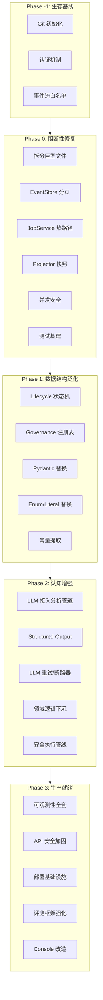

# RelationshipOS 全面修复计划（93 条问题，5 阶段）

## 问题全景




---

## Phase -1: 生存基线（1 天）

> 在此之前任何其他修复都没有意义。

### -1.1 Git 初始化 [#19]

- 在项目根目录执行 `git init && git add . && git commit -m "initial: snapshot before systematic refactoring"`
- 创建 `.gitignore`：排除 `.venv/`, `__pycache__/`, `.env`, `*.pyc`, `.pytest_cache/`
- 建议立即推送到 GitHub/GitLab 私有仓库作为远程备份

### -1.2 认证机制 [#16]

- 在 [src/relationship_os/core/config.py](src/relationship_os/core/config.py) 中增加 `api_key: str = ""` 配置项
- 新建 `src/relationship_os/api/auth.py`，实现 API Key 校验依赖：

```python
from fastapi import Depends, HTTPException, Security
from fastapi.security import APIKeyHeader

_header = APIKeyHeader(name="X-API-Key", auto_error=False)

async def require_api_key(
    key: str | None = Security(_header),
    container: RuntimeContainer = Depends(get_container),
) -> None:
    expected = container.settings.api_key
    if expected and key != expected:
        raise HTTPException(status_code=401, detail="Invalid API key")
```

- 在 [src/relationship_os/api/router.py](src/relationship_os/api/router.py) 中将 `require_api_key` 加入 `dependencies` 参数（Console 和 healthz 可豁免）

### -1.3 事件流写入白名单 [#17]

- 在 [src/relationship_os/api/routes/streams.py](src/relationship_os/api/routes/streams.py) 的 `append_events` 中增加 `event_type` 白名单校验：

```python
from relationship_os.domain.event_types import ALLOWED_EXTERNAL_EVENT_TYPES

for item in payload.events:
    if item.event_type not in ALLOWED_EXTERNAL_EVENT_TYPES:
        raise HTTPException(status_code=422, detail=f"Disallowed event type: {item.event_type}")
```

- 在 [src/relationship_os/domain/event_types.py](src/relationship_os/domain/event_types.py) 中定义 `ALLOWED_EXTERNAL_EVENT_TYPES` frozenset（仅包含外部可写的事件类型）

### -1.4 硬编码凭据清理 [#H-1, #O-05, #O-15]

- [src/relationship_os/core/config.py](src/relationship_os/core/config.py): 将 `database_url` 默认值改为空字符串，在 `model_validator` 中检查：如果 `event_store_backend == "postgres"` 且 `database_url` 为空则报错
- `alembic.ini`: 将 `sqlalchemy.url` 替换为 `%(RELATIONSHIP_OS_DATABASE_URL)s`，通过 `alembic/env.py` 的 `config.set_main_option` 从环境变量注入

---

## Phase 0: 阻断性工程修复（5-7 天）

> 解决运行时崩溃、性能炸弹和最基本的工程卫生。

### 0.1 拆分 `analyzers.py`（27K 行）[#1]

**目标结构**：

```
application/analyzers/
  __init__.py          # re-export 全部 public 函数（向后兼容）
  _utils.py            # _clamp, _compact, _contains_chinese, _contains_any,
                       # _strategy_entropy, _strategy_alternatives (~100 行)
  context.py           # build_context_frame, infer_* (~200 行)
  relationship.py      # build_relationship_state, build_repair_* (~400 行)
  cognition.py         # build_confidence, build_knowledge_boundary,
                       # build_private_judgment (~300 行)
  strategy.py          # build_policy_gate, build_strategy_decision,
                       # build_rehearsal_result (~500 行)
  expression.py        # build_expression_plan, build_empowerment_audit,
                       # build_response_* (~800 行)
  coordination.py      # build_runtime_coordination, build_guidance_plan,
                       # build_cadence, build_ritual, build_somatic (~600 行)
  proactive/
    __init__.py
    directive.py       # build_proactive_followup_directive 等
    scheduling.py      # cadence, scheduling, guardrail, progression
    dispatch.py        # gate, envelope, feedback, refresh, replan
    controllers.py     # stage/line/orchestration/aggregate controllers
    lifecycle.py       # 全部 lifecycle 函数（Phase 1 再泛化）
  governance.py        # build_system3_snapshot 及所有 governance 计算
  session.py           # build_session_directive, build_inner_monologue,
                       # build_session_snapshot, build_archive_status
  quality.py           # build_runtime_quality_doctor_report,
                       # build_response_normalization_result,
                       # build_offline_consolidation_report
```

**执行步骤**：

1. 创建 `application/analyzers/` 目录和 `__init__.py`
2. 从底部（无依赖的工具函数）开始，逐模块剪切粘贴
3. 每移动一个模块后运行 `uv run pytest` 确认无回归
4. `__init__.py` 中用 `from .context import` * 等保持对外接口不变
5. 最后删除原 `analyzers.py`

### 0.2 拆分 `runtime_service.py`（6300 行）[#2]

**剥离方向**：

- 提取 `RuntimeStateMapper` 类 → `application/runtime_state_mapper.py`：负责从 projection dict 反序列化为 domain 对象（消灭数百行 `.get()` 手工解析）
- 提取 `ProactiveDispatchPipeline` → `application/proactive_dispatch_pipeline.py`：`dispatch_proactive_followup` 及其 lifecycle 链（约 4000 行）
- `RuntimeService` 本体只保留 `create_session`、`process_turn`、`list_sessions`

### 0.3 拆分其余巨型文件 [#Q-02 ~ #Q-07]


| 文件                                      | 行数                                                                                                                                                                              | 拆分方案 |
| --------------------------------------- | ------------------------------------------------------------------------------------------------------------------------------------------------------------------------------- | ---- |
| `evaluation_service.py` (14K)           | 拆为 `evaluation/summary_builder.py`、`evaluation/quality_detector.py`、`evaluation/preference_builder.py`、`evaluation/service.py`                                                  |      |
| `proactive_followup_service.py` (7K)    | 将 6500 行的 `_build_followup_item` 拆为 `proactive/queue_builder.py`（队列评估）、`proactive/schedule_resolver.py`（调度计算）、`proactive/lifecycle_evaluator.py`（lifecycle 链）                   |      |
| `console.py` (6.7K)                     | 拆为 `console/layout.py`（布局）、`console/fragments.py`（HTMX 片段）、`console/styles.py`（CSS/JS）、`console/routes.py`（路由注册）                                                                |      |
| `scenario_evaluation_service.py` (4.8K) | 拆为 `scenario/catalog.py`（场景定义）、`scenario/runner.py`（执行）、`scenario/reporter.py`（报告生成）                                                                                            |      |
| `contracts.py` (2.8K)                   | 拆为 `domain/contracts/context.py`、`domain/contracts/relationship.py`、`domain/contracts/proactive.py`、`domain/contracts/governance.py`、`domain/contracts/session.py`（Phase 1 再泛化） |      |


### 0.4 EventStore 分页与性能 [#4, #14, #18, #23, #24, #25]

**0.4.1 `read_stream` 增加 limit/after_version 参数**：

```python
# domain/event_store.py — Protocol 新增方法签名
async def read_stream(
    self,
    *,
    stream_id: str,
    after_version: int = 0,
    limit: int | None = None,
) -> list[StoredEvent]: ...

async def read_stream_iter(
    self,
    *,
    stream_id: str,
    batch_size: int = 500,
) -> AsyncIterator[StoredEvent]: ...

async def list_stream_ids(self) -> list[str]: ...
```

**0.4.2 PostgresEventStore 实现**：

- `read_stream`: 增加 `WHERE version > :after_version` + `LIMIT :limit`
- `list_stream_ids`: 新增 `SELECT DISTINCT stream_id FROM event_records`
- `read_all` 改为内部使用游标（`yield_per(500)`）

**0.4.3 DB 连接池配置** ([infrastructure/db/engine.py](src/relationship_os/infrastructure/db/engine.py)):

```python
def build_async_engine(database_url: str, settings: Settings) -> AsyncEngine:
    return create_async_engine(
        database_url,
        pool_pre_ping=True,
        pool_size=settings.db_pool_size,           # 默认 10
        max_overflow=settings.db_max_overflow,      # 默认 20
        pool_recycle=settings.db_pool_recycle,      # 默认 3600
        pool_timeout=settings.db_pool_timeout,      # 默认 30
    )
```

**0.4.4 DB 索引补充** — 新增 Alembic 迁移：

- `CREATE INDEX ix_event_records_event_type ON event_records (event_type)`
- `CREATE INDEX ix_event_records_occurred_at ON event_records (occurred_at)`
- `ALTER TABLE event_records ADD CONSTRAINT ck_version_positive CHECK (version > 0)`

### 0.5 JobService 热路径修复 [#18, #20]

**问题**：`_list_job_records` 每 0.5s 全量扫描所有事件。

**方案**：为 Job 系统引入专用 stream prefix（如 `job:{job_id}`），并在 `JobService` 内部维护内存索引：

```python
class JobService:
    def __init__(self, ...) -> None:
        self._job_index: dict[str, JobRecord] = {}  # job_id -> latest state
        self._index_version: int = 0

    async def _refresh_index(self) -> None:
        """增量刷新：只读取 version > self._index_version 的新事件。"""
        new_events = await self._stream_service.read_stream(
            stream_id="__jobs__",
            after_version=self._index_version,
        )
        for event in new_events:
            self._apply_job_event(event)
            self._index_version = event.version
```

### 0.6 Projector 快照机制 [#3, #22]

在 `StreamService.project_stream` 中引入快照缓存：

```python
async def project_stream(self, *, stream_id: str, projector_name: str, projector_version: str) -> dict:
    projector = self._projector_registry.resolve(name=projector_name, version=projector_version)
    snapshot = await self._load_snapshot(stream_id, projector_name, projector_version)
    if snapshot:
        state = snapshot.state
        events = await self._event_store.read_stream(
            stream_id=stream_id, after_version=snapshot.at_version
        )
    else:
        state = projector.initial_state()
        events = await self._event_store.read_stream(stream_id=stream_id)
    for event in events:
        state = projector.apply(state, event)
    return {"version": events[-1].version if events else 0, "state": state}
```

快照存储可复用 event_records 表（用特殊 event_type `__snapshot`__），或新建 `projection_snapshots` 表。

### 0.7 并发安全修复 [#20, #21, #39, #40, #41, #42, #43, #44, #45]


| 问题                                                  | 修复                                                                                      |
| --------------------------------------------------- | --------------------------------------------------------------------------------------- |
| `RuntimeContainer.shutdown` 不容忍失败 [#20]             | 用 `asyncio.gather(*shutdowns, return_exceptions=True)` + 逐项 log                         |
| `RuntimeService` 无 per-session 锁 [#40]              | 加 `_session_locks: dict[str, asyncio.Lock]` 按 session_id 加锁，防止并发 LLM 浪费                 |
| `JobExecutor` 无并发上限 [#41]                           | 用 `asyncio.Semaphore(max_concurrent_jobs)` 限流                                           |
| `Dispatcher.shutdown` 时序错误 [#42]                    | 先 `await gather(poller_task)`，再 `_active_dispatches.clear()`                            |
| `JobExecutor.shutdown` 任务泄漏 [#43]                   | 在 gather 完成后再获锁检查是否有新 task                                                              |
| `RuntimeEventBroker.shutdown` 不通知 [#44]             | shutdown 时向每个 queue 放入 sentinel `None`，subscriber 收到 None 后退出                           |
| `RuntimeEventBroker.publish` 静默丢弃 [#39]             | 添加 `_dropped_count` 计数器 + structlog 警告                                                  |
| `PostgresEventStore` expected_version=None 行为 [#21] | 当 `expected_version is None` 时用 `ON CONFLICT DO NOTHING` 或捕获 IntegrityError 后自动重试       |
| 缺少 CancelledError 处理 [#45]                          | 在 `process_turn` 和 `dispatch_proactive_followup` 中加 `try/except asyncio.CancelledError` |


### 0.8 测试基建 [#5]

**0.8.1 创建 `tests/conftest.py`**：

```python
import pytest
from fastapi.testclient import TestClient
from relationship_os.main import create_app
from relationship_os.application.container import RuntimeContainer

@pytest.fixture
def app():
    return create_app()

@pytest.fixture
def client(app) -> TestClient:
    return TestClient(app)

@pytest.fixture
def container(app) -> RuntimeContainer:
    return app.state.container

@pytest.fixture
def session_with_turn(client: TestClient) -> dict:
    resp = client.post("/api/v1/sessions/test-session/turns", json={"content": "我有点焦虑"})
    return resp.json()
```

**0.8.2 为核心 builder 函数添加单元测试**：

```
tests/
  conftest.py
  test_analyzers/
    test_context.py          # infer_dialogue_act, infer_bid_signal, build_context_frame
    test_relationship.py     # build_relationship_state 边界测试
    test_strategy.py         # build_policy_gate, build_strategy_decision
    test_governance.py       # build_system3_snapshot
  test_event_store/
    test_postgres.py         # 乐观并发、分页、expected_version=None
    test_memory.py           # 排序一致性、锁安全
  test_projectors/
    test_runtime_projector.py    # 事件覆盖完整性
    test_transcript_projector.py # 硬编码字符串修复后验证
```

### 0.9 Projector 正确性修复 [#30, #31, #32, #35, #36, #37]


| 问题                                            | 修复                                                      |
| --------------------------------------------- | ------------------------------------------------------- |
| `SCENARIO_BASELINE_*` 无 Projector [#30]       | 在 `SessionRuntimeProjector` 中添加处理分支                     |
| `SESSION_DIRECTIVE_UPDATED` 覆盖但不更新计数器 [#31]   | 在覆盖字段时同步递增对应 `_count`                                   |
| `SessionTranscriptProjector` 硬编码字符串 [#32]     | 替换为 `USER_MESSAGE_RECEIVED`、`ASSISTANT_MESSAGE_SENT` 常量 |
| `InnerMonologueBufferProjector` 无界 [#35]      | 加 `MAX_BUFFER_SIZE = 100`，超出时裁剪最旧条目                     |
| `SessionRuntimeProjector.messages` 无界 [#36]   | 加 `MAX_MESSAGES = 200` 滑动窗口                             |
| `SessionSnapshotProjector.snapshots` 无界 [#37] | 加 `MAX_SNAPSHOTS = 50` 滑动窗口                             |


### 0.10 InMemoryEventStore 修复 [#26, #27]

- `read_all()`: 按 `(occurred_at, stream_id, version)` 排序后返回，与 Postgres 行为一致
- `read_stream()` / `read_all()`: 在 `async with self._lock:` 内执行（与 `append` 对称）

---

## Phase 1: 数据结构泛化与强类型改造（5-7 天）

> 消灭大量重复代码，从根源减少维护负担。

### 1.1 Lifecycle 状态机泛化 [#6, #73, #80, #D-05, #D-06]

**1.1.1 泛化 dataclass**（[domain/contracts/proactive.py](src/relationship_os/domain/contracts.py) 重构后）：

```python
@dataclass(slots=True, frozen=True)
class ProactiveLifecycleStageDecision:
    stage_name: str           # "activation", "settlement", ..., "stratum"
    status: str
    stage_key: str
    current_stage_label: str
    lifecycle_state: str
    parent_mode: str
    current_mode: str
    decision: str
    actionability: str
    changed: bool
    active_stage_label: str | None = None
    next_stage_label: str | None = None
    queue_override_status: str | None = None
    remaining_stage_count: int = 0
    line_state: str = "steady"
    line_exit_mode: str = "stay"
    additional_delay_seconds: int = 0
    selected_strategy_key: str = "none"
    selected_pressure_mode: str = "none"
    selected_autonomy_signal: str = "none"
    selected_delivery_mode: str = "none"
    primary_source: str = "parent"
    parent_decision: str | None = None
    active_sources: tuple[str, ...] = ()
    stage_notes: tuple[str, ...] = ()
    rationale: str = ""
```

**1.1.2 配置驱动的 lifecycle 链**：

```python
# application/analyzers/proactive/lifecycle_config.py
LIFECYCLE_CHAIN: tuple[str, ...] = (
    "activation", "settlement", "closure", "handoff",
    "continuation", "sustainment", "stewardship", "guardianship",
    "oversight", "assurance", "attestation", "verification",
    "certification", "confirmation", "ratification", "endorsement",
    "authorization", "enactment", "finality", "completion",
    "conclusion", "disposition", "standing", "residency",
    "tenure", "persistence", "durability", "longevity",
    "legacy", "heritage", "lineage", "ancestry",
    "provenance", "origin", "root", "foundation",
    "bedrock", "substrate", "stratum",
)

@dataclass(frozen=True)
class LifecycleStageConfig:
    terminal_decisions: frozenset[str]
    default_mode: str = "follow_parent"
```

**1.1.3 单一泛化 builder 函数**：

```python
def build_proactive_lifecycle_stage_decision(
    *,
    stage_name: str,
    parent_decision: ProactiveLifecycleStageDecision | None,
    lifecycle_root_decision: ProactiveLifecycleActivationDecision,
    stage_config: LifecycleStageConfig,
    # 共享上下文...
) -> ProactiveLifecycleStageDecision:
```

