# RelationshipOS — 长期关系型认知主体运行时（终极版 v3，融合 78 项前沿研究）

## 当前进度快照（更新于 2026-03-22）

- `PLAN.md` 原始设计目标仍然是“终极版”，当前仓库还没有走完整个 66 天路线。
- 按“最终深度”估算：已完成约 `98%~99%`，剩余约 `1%~2%`。
- 状态含义：
  - `completed` = 该 Phase 的最小目标已经基本落地
  - `in_progress` = 已有可运行竖切，但离计划深度还有明显差距
  - `pending` = 还没有真正展开，或只存在零散铺垫
- 当前仓库更准确地说是：已经完成骨架、事件流、LLM 抽象、核心运行时主链、只读控制台、初版场景评测，并开始形成 `System 3` 元运行时；这层除了身份追踪、成长阶段、用户认知模型、情感债务、策略审计统一快照外，现在还新增了显式 `moral reasoning`，会把 `moral_reasoning_status / moral_posture / moral_conflict / moral_principles` 一起写进 `System 3` 状态并暴露到评测与控制台；这轮又进一步补上了显式 `moral trajectory`，会把 `moral_trajectory_status / moral_trajectory_target / moral_trajectory_trigger` 一起写进 `System 3` 状态，并用于单 session 评测、策略偏好过滤和控制台观察，使道德判断不再只是看当前这一拍是否 `watch/revise`，而是开始显式判断“这条 moral line 最近是在稳住、拉扯，还是已经需要 re-center”；这轮还补上了显式 `emotional debt trajectory`，会把 `emotional_debt_trajectory_status / emotional_debt_trajectory_target / emotional_debt_trajectory_trigger` 一起写进 `System 3` 状态，并用于单 session 评测、策略偏好过滤和控制台观察，使情感债务不再只是看当前是 `low/watch/elevated`，而是开始显式判断“这条 debt line 最近是在稳住、积压观察，还是已经需要先减压”；这轮又补上了显式 `strategy supervision trajectory`，会把 `strategy_supervision_trajectory_status / strategy_supervision_trajectory_target / strategy_supervision_trajectory_trigger` 一起写进 `System 3` 状态，并用于单 session 评测、策略偏好过滤和控制台观察，使策略监督不再只是看这轮是 `pass/watch/revise`，而是开始显式判断“这条 supervision line 最近是在稳住、观测，还是已经该 tighten”；同时也补上了显式 `user model evolution`，会把 `user_model_evolution_status / user_model_revision_mode / user_model_shift_signal` 一起写进 `System 3` 状态并用于单 session 评测、策略偏好过滤和控制台观察；这轮又新增了显式 `growth transition assessment`，会把 `growth_transition_status / growth_transition_target / growth_transition_trigger / growth_transition_readiness` 一起写进 `System 3` 状态，并用于单 session 评测、策略偏好过滤和控制台观察，使 `growth_stage` 不再只是静态标签，而是开始显式判断“当前是在稳住、准备升级，还是该先回 repair”；现在还新增了显式 `identity trajectory`，会把 `identity_trajectory_status / identity_trajectory_target / identity_trajectory_trigger` 一起写进 `System 3` 状态，并用于单 session 评测、策略偏好过滤和控制台观察，使 identity tracking 不再只是看某一拍是否 drift，而是开始显式判断“identity 这条线最近是在稳住、轻微偏移，还是已经需要 re-center”。同时，`Phase 11` 的协调层、显式 `guidance plan`、首版主动跟进计划、可查询的 time-driven re-engagement 队列、第一版自动 proactive dispatcher，以及显式的 ritual-aware `re-engagement plan` 和首版 `re-engagement strategy matrix` 已接入主链；`guidance plan` 已开始向 ritual/handoff/carryover 这种更动作化的引导层推进，现在还有统一的 `conversation cadence plan` 把当前 turn 的节奏、下一拍 handoff、follow-up tempo 和用户空间管理收束成可观测状态，并进一步补上了显式 `session ritual plan`，把 opening/bridge/closing/somatic shortcut 动作化；另外，主动重连现在还多了一层显式 `proactive cadence plan`，可以把同一条重连线按 `first_touch -> second_touch -> final_soft_close` 这样多拍、低压地继续推进，同时新增了显式 `somatic orchestration plan`，把身体层微动作收束成 `primary_mode / body_anchor / followup_style / allow_in_followup` 这种可观测状态；这条线又进一步补上了显式 `proactive scheduling plan`，把主动队列从简单的 `waiting -> due` 推进成带 `scheduled` 延迟态、显式 outbound cooldown 和 low-pressure guard 的调度层，并新增显式 `proactive orchestration plan`，把不同 stage 的 objective / delivery mode / question mode / closing style 收束成真正的多阶段主动对话编排；现在还进一步补上了显式 `proactive actuation plan`，把每个 stage 的 `opening_move / bridge_move / closing_move / continuity_anchor / somatic_mode` 收束成真正会影响输出的 ritual / somatic 动作层，而且这些字段已经真的进入 follow-up 文案和 queue/dispatch 生命周期，而不只是停在观测层；这轮又补上了显式 `proactive progression plan`，把每个 stage 在“挂太久”时该怎么自动进位、跳到 `final_soft_close` 或静默收线说成结构化规则，让主动队列不再只是被动挂成 `overdue`；现在还新增了显式 `re-engagement matrix assessment`，会先输出带分数、blocked 标记和 ranked candidates 的候选矩阵，再把选中的策略落成 `re-engagement plan`，让“选中了什么、哪些被拦住、还有什么备选”都进入 audit / evaluation / console；同时也新增了显式 `proactive guardrail plan`，把每条主动线最多允许打几拍、每一拍至少要留多少用户空间、什么时候必须提前收线说成结构化规则，并让 queue / progression 真的按它把某些 stage 先放进 `scheduled` 而不是直接 `due`；这轮又进一步补上了显式 `proactive stage refresh plan`，让 dispatcher 在真正发出某一拍之前，能按当前 stage、dispatch window、progression/guardrail 命中情况和最新 guidance / `System 3` 信号再做一次临发重评估，把 second-touch/final-soft-close 这类后续触达真正软化成更低压的 bridge / closing / user-space 执行；现在还新增了显式 `proactive stage replan assessment`，让 dispatcher 在 refresh 之后、真正发出前再重判这拍到底该沿用原策略，还是切到更低压的 `resume / repair / continuity` 路径，并把 `selected_strategy_key / selected_ritual_mode / selected_pressure_mode / selected_autonomy_signal / changed` 真正写进 dispatch payload、audit、evaluation 和 console；这轮继续补上了显式 `proactive dispatch gate decision`，让 dispatcher 在最终发出前还能决定“这拍虽然 technically due，但现在最好再留一点空间”，并把 final soft close 这类最后一拍真的打回 `scheduled` 而不是立刻发出去；现在又补上了显式 `proactive dispatch feedback assessment`，让 dispatcher 能把“上一拍已经发过几次、有没有被 gate defer 过、上一拍最后落成了哪种 pressure/autonomy 形状”继续反馈给下一拍的 replan，使 second touch 和 final soft close 真正开始吸收上一拍的触达结果而不是只做静态重判；这轮再补上了显式 `proactive stage controller decision`，把“上一拍已经成功触达了，所以下一拍要不要更晚一点、要不要直接切成更低压的 strategy / pressure / autonomy / delivery mode”推进成结构化 controller，并让主动队列真的按它给 second touch / final soft close 增加额外 spacing；现在又进一步把这层 controller 接进了下一拍 refresh / replan，让 controller 选出来的更低压 `strategy / delivery / autonomy` 会真的进入下一拍 dispatch，而不只是停在时间窗口上；这轮又新增了显式 `proactive line controller decision`，把“整条剩余主动线是 steady、softened 还是 close-ready”推进成 line-level posture，并让 queue / refresh / replan 真正开始吸收这层 line posture，使后续 stage 不只是各自单独降压，而是开始共享一条会逐拍演化的低压控制层；这轮又进一步把 `System 3 safety governance` 真正接进 stage/line controller，使 `second_touch / final_soft_close` 在 `safety_governance_status / trajectory_status` 进入 `watch / recenter` 时会真实切到更低压、更慢一点的 `repair_soft_resume_bridge / continuity_soft_ping` 形状，而不只是留在可观测层；现在还进一步把 `System 3 stability / pressure / trust / continuity / repair governance` 也接进了 `stage replan / stage controller / line controller / dispatch gate` 主链，使 `second_touch / final_soft_close` 即使在 `safety` 仍然稳定时，只要 `stability_governance_status / trajectory_status`、`pressure_governance_status / trajectory_status`、`trust_governance_status / trajectory_status`、`continuity_governance_status / trajectory_status` 或 `repair_governance_status / trajectory_status` 进入 `watch / recenter`，也会真实切到更低压、更慢一点的 buffer/spacing 形状；同时队列也会在最后一拍真正 dispatch 完成后立即收线，不再残留一条假性待跟进项；另外，`Phase 15` 现在也新增了显式 `hardening checklist`，可以把 `ship readiness`、`misalignment taxonomy`、关键 redteam/quality/`System 3` 热点进一步收束成更接近上线决策的 release hardening 视图，且这轮又补上了单独的 `redteam robustness report`，把最近 redteam 覆盖、通过率、关键 redteam 事故、boundary decision、policy path 和 audit 一致性收束成独立观察面；同时 `Phase 14/15` 这轮也新增了显式 `longitudinal report`，可以把最近 cohort 和上一段 cohort 的整体 pass rate、quality watch 漂移、redteam pass rate、boundary guard rate，以及最新 quality/doctor/`System 3` 姿态收束成更接近“多周趋势”的纵向报告；这轮又补上了独立 `safety audit report`，把 replay 一致性、关键 boundary/dependency/policy taxonomy、redteam boundary guard rate、post-audit 违规结果数，以及 runtime quality doctor / `System 3` watch 压力收成单独安全报告；现在还补上了独立 `baseline governance report`，把 baseline 是否可重建、是否 full-suite/redteam 覆盖、已经滞后了多少 newer runs，以及 latest-vs-baseline drift 收束成单独治理视图，并让 `hardening checklist` 直接吸收这层结果；这轮还新增了独立 `migration readiness report`，把注册 projector 在最近 session 样本上的 replay / rebuild 一致性、primary runtime 样本覆盖和 scenario fallback 使用情况收束成单独治理视图，并让 `hardening checklist`、`release dossier` 和 `launch signoff` 都能直接吸收这层结果；这轮又新增了统一 `release dossier`，可以把 release gate、ship readiness、hardening checklist、safety audit、redteam robustness、baseline governance、migration readiness 和 longitudinal report 收束成一份更接近真实发版决策的最终过线材料；现在还进一步补上了显式 `launch signoff` 矩阵，把 `candidate_quality / runtime_operations / safety_barriers / governance` 四个签核域的 `approved / review / hold` 状态统一收口成更接近真实上线签核的 final matrix；这轮还新增了显式 `horizon report`，可以把 short / medium / long 三个窗口的 pass rate、quality watch、System 3 watch 和 redteam boundary guard 漂移拆开看，让纵向评测开始从“单一 cohort 对比”推进到更接近长期趋势分层观察；现在又补上了显式 `multiweek report`，把真实时间桶里的 latest/prior bucket pass rate、quality watch 和 redteam boundary guard 漂移拆出来，让纵向评测开始真正具备按周维度观察最近几段历史的能力；同时这轮还新增了显式 `sustained drift report`，可以直接判断最近几段周桶是否已经连续走坏，而不只是做相邻 bucket 的一次性对比；但距离完整主动对话、纵向评测、安全收口仍有后半程。
- `Phase 11` 这轮又把 `re-engagement strategy matrix` 做成了第一版真正的 `learnable matrix`：runtime 现在会按当前 proactive context 拉取非 scenario 历史 session 的 re-engagement learning report，把 `contextual/global reinforcement` 回流进 matrix scoring；如果某个后续触达仍然处在 `cold start` 或只有很薄的历史支撑，队列还会自动追加 `matrix_learning_buffered` 的 spacing，让 `second_touch / final_soft_close` 在学习信号不足时更保守地排程。
- `Phase 10` 这轮又新增了显式 `expectation calibration`：`System 3` 现在会额外产出 `expectation_calibration_status / target / trigger`，以及对应的 `expectation_calibration_trajectory_status / target / trigger`，用来判断用户对支持强度、边界、确定性和节奏的期待，是稳定、需要 watch，还是已经应该 reset。第一版 heuristics 会把 `dependency_pressure_detected`、`relational_boundary_required`、`uncertainty_disclosure_required`、`clarification_required`、`repair_pressure_requires_soft_expectation` 和 `segmented_delivery_active` 这类触发原因显式化，并同步暴露到单 session 评测、策略偏好过滤和控制台。
- `Phase 10` 这轮又新增了显式 `version migration posture`：`System 3` 现在会额外产出 `version_migration_status / version_migration_scope / version_migration_trigger / version_migration_notes`，用来判断当前 session 是已经适合稳定 replay/rebuild、需要 `cautious_rebuild`，还是应该先 `hold_rebuild`；这层已经进入单 session 评测、策略偏好过滤和控制台，所以“版本迁移”不再只停在 release 侧的 migration readiness 报告。
- `Phase 10` 这轮又新增了显式 `version migration trajectory`：`System 3` 现在会额外产出 `version_migration_trajectory_status / version_migration_trajectory_target / version_migration_trajectory_trigger / version_migration_trajectory_notes`，用来判断这条 migration line 是在稳住、进入 `watch`，还是已经需要 `hold`；这层已经进入单 session 评测、策略偏好过滤和控制台，所以“版本迁移治理”开始从“这一拍能不能重建”推进到“这条 migration line 最近是在稳住、观测，还是已经该先 hold 住”。
- `Phase 10` 这轮又新增了显式 `growth transition trajectory`：`System 3` 现在会额外产出 `growth_transition_trajectory_status / growth_transition_trajectory_target / growth_transition_trajectory_trigger / growth_transition_trajectory_notes`，用来判断这条 growth line 是在稳住、进入 `watch`、准备 `advance`，还是已经需要 `redirect`；这层已经进入单 session 评测、策略偏好过滤和控制台，所以“成长阶段跃迁”开始从“这一拍要不要往前走”推进到“这条 growth line 最近是在稳住、观测、准备前进，还是已经该先回修复/稳态”。
- `Phase 10` 这轮又新增了显式 `strategy audit trajectory`：`System 3` 现在会额外产出 `strategy_audit_trajectory_status / strategy_audit_trajectory_target / strategy_audit_trajectory_trigger / strategy_audit_trajectory_notes`，用来判断这条 audit line 是在稳住、进入 `watch`，还是已经需要 `corrective`；这层已经进入单 session 评测、策略偏好过滤和控制台，所以“策略审计”开始从“这一拍是 pass/watch/revise”推进到“这条 audit line 最近是在稳住、观测，还是已经该进入 corrective”。
- `Phase 10` 这轮又新增了显式 `strategy supervision`：`System 3` 现在会额外产出 `strategy_supervision_status / strategy_supervision_mode / strategy_supervision_trigger / strategy_supervision_notes`，用来判断这轮策略只是稳定受控、需要 guided/risk/boundary watch，还是已经该进入 corrective / repair-override / boundary-lock 这种更强监督模式；这层已经进入单 session 评测、策略偏好过滤和控制台，所以“更强的策略监督”开始从 TODO 变成主链内可观测状态。
- `Phase 10` 这轮又新增了显式 `moral trajectory`：`System 3` 现在会额外产出 `moral_trajectory_status / moral_trajectory_target / moral_trajectory_trigger / moral_trajectory_notes`，用来判断这条道德线是在稳住、轻微拉扯，还是已经需要 re-center；这层已经进入单 session 评测、策略偏好过滤和控制台，所以“更成熟的道德推理”开始从“当前这拍要不要 revise”推进到“这条 moral line 最近是在稳住、拉扯，还是已经该回更安全的中心”。
- `Phase 10` 这轮又新增了显式 `emotional debt trajectory`：`System 3` 现在会额外产出 `emotional_debt_trajectory_status / emotional_debt_trajectory_target / emotional_debt_trajectory_trigger / emotional_debt_trajectory_notes`，用来判断这条债务线是在稳住、进入 watch，还是已经需要先做 `decompression`；这层已经进入单 session 评测、策略偏好过滤和控制台，所以“情感债务”开始从静态状态推进到显式的长期线条判断。
- `Phase 10` 这轮又新增了显式 `strategy supervision trajectory`：`System 3` 现在会额外产出 `strategy_supervision_trajectory_status / strategy_supervision_trajectory_target / strategy_supervision_trajectory_trigger / strategy_supervision_trajectory_notes`，用来判断这条 supervision line 是在稳住、进入 watch，还是已经需要 `tighten`；这层已经进入单 session 评测、策略偏好过滤和控制台，所以“更成熟的策略监督”开始从“这一拍怎么管”推进到“这条 supervision line 最近是在稳住、观测，还是已经该收紧”。
- `Phase 10` 这轮又新增了显式 `user model trajectory`：`System 3` 现在会额外产出 `user_model_trajectory_status / user_model_trajectory_target / user_model_trajectory_trigger / user_model_trajectory_notes`，用来判断这条用户模型线是在稳住、轻微漂移，还是已经需要 re-center；这层已经进入单 session 评测、策略偏好过滤和控制台，所以“长期用户模型演化”开始从“这轮要不要修”推进到“这条模型线最近是在稳住、偏移，还是已经该回中心”。
- `Phase 10` 这轮又新增了显式 `dependency governance`：`System 3` 现在会额外产出 `dependency_governance_status / target / trigger`，以及对应的 `dependency_governance_trajectory_status / target / trigger`，用来判断支持这条线是在稳住、进入 watch，还是已经需要 re-center 到更低依赖、更强边界或先 repair 再 reliance 的姿态；这层已经进入单 session 评测、策略偏好过滤和控制台，所以“dependency governance”开始从 relationship state 里的单点风险信号推进到显式长期治理线。
- `Phase 10` 这轮又新增了显式 `autonomy governance`：`System 3` 现在会额外产出 `autonomy_governance_status / target / trigger`，以及对应的 `autonomy_governance_trajectory_status / target / trigger`，用来判断支持方式这条线是在稳住、进入 watch，还是已经需要 re-center 到更明确的 user space、context-before-commitment 或 explicit autonomy support；这层已经进入单 session 评测、策略偏好过滤和控制台，所以“autonomy governance”开始从低压表达风格的隐式要求推进到显式长期治理线。
- `Phase 10` 这轮又新增了显式 `boundary governance`：`System 3` 现在会额外产出 `boundary_governance_status / target / trigger`，以及对应的 `boundary_governance_trajectory_status / target / trigger`，用来判断边界这条线是在稳住、进入 watch，还是已经需要 re-center 到更明确的 hard boundary / explicit boundary support / uncertainty boundary support；这层已经进入单 session 评测、策略偏好过滤和控制台，所以“boundary governance”开始从 policy gate 和 knowledge boundary 的单点结果推进到显式长期治理线。
- `Phase 10` 这轮又新增了显式 `support governance`：`System 3` 现在会额外产出 `support_governance_status / target / trigger`，以及对应的 `support_governance_trajectory_status / target / trigger`，用来判断整条 support line 是在稳住、进入 watch，还是已经需要 re-center 到更 bounded、更 user-led 的支撑姿态；这层已经进入单 session 评测、策略偏好过滤和控制台，所以“support governance”开始把 dependency / autonomy / boundary 三条分散治理线进一步收束成统一长期治理视角。
- `Phase 10` 这轮又新增了显式 `continuity governance`：`System 3` 现在会额外产出 `continuity_governance_status / target / trigger`，以及对应的 `continuity_governance_trajectory_status / target / trigger`，用来判断整条 continuity line 是在稳住、进入 watch，还是已经需要 re-center 到更明确的 `context_reanchor_continuity / memory_regrounded_continuity / clarified_context_continuity`；这层已经进入单 session 评测、策略偏好过滤和控制台，所以“continuity governance”开始把 recall / re-anchor / thin-context 这类分散连续性信号进一步收束成统一长期治理视角。
- `Phase 10` 这轮又新增了显式 `repair governance`：`System 3` 现在会额外产出 `repair_governance_status / target / trigger`，以及对应的 `repair_governance_trajectory_status / target / trigger`，用来判断整条 repair line 是在稳住、进入 watch，还是已经需要 re-center 到更明确的 `boundary_safe_repair_containment / attunement_repair_scaffold / clarity_repair_scaffold`；这层已经进入单 session 评测、策略偏好过滤和控制台，所以“repair governance”开始把 repair severity / emotional debt / continuity / support 这类分散修复信号进一步收束成统一长期治理视角。
- `Phase 10` 这轮又新增了显式 `trust governance`：`System 3` 现在会额外产出 `trust_governance_status / target / trigger`，以及对应的 `trust_governance_trajectory_status / target / trigger`，用来判断整条 trust line 是在稳住、进入 watch，还是已经需要 re-center 到更明确的 `boundary_safe_trust_containment / reanchor_before_trust_rebuild / repair_first_trust_rebuild`；这层已经进入单 session 评测、策略偏好过滤和控制台，所以“trust governance”开始把 psychological safety / turbulence / repair / continuity / support 这类分散信任信号进一步收束成统一长期治理视角。
- `Phase 10` 这轮又新增了显式 `clarity governance`：`System 3` 现在会额外产出 `clarity_governance_status / target / trigger`，以及对应的 `clarity_governance_trajectory_status / target / trigger`，用来判断整条 clarity line 是在稳住、进入 watch，还是已经需要 re-center 到更明确的 `reanchor_before_clarity_commitment / uncertainty_first_clarity_scaffold / repair_scaffolded_clarity`；这层已经进入单 session 评测、策略偏好过滤和控制台，所以“clarity governance”开始把 clarification / uncertainty / filtered recall / expectation / segmented delivery 这类分散清晰度信号进一步收束成统一长期治理视角。
- `Phase 10` 这轮又新增了显式 `pacing governance`：`System 3` 现在会额外产出 `pacing_governance_status / target / trigger`，以及对应的 `pacing_governance_trajectory_status / target / trigger`，用来判断整条 pacing line 是在稳住、进入 watch，还是已经需要 re-center 到更明确的 `decompression_first_pacing / repair_first_pacing / expectation_reset_pacing`；这层已经进入单 session 评测、策略偏好过滤和控制台，所以“pacing governance”开始把 debt / repair / expectation / trust / clarity / segmented delivery 这类分散节奏信号进一步收束成统一长期治理视角。
- `Phase 10` 这轮又新增了显式 `attunement governance`：`System 3` 现在会额外产出 `attunement_governance_status / target / trigger`，以及对应的 `attunement_governance_trajectory_status / target / trigger`，用来判断整条 attunement line 是在稳住、进入 watch，还是已经需要 re-center 到更明确的 `attunement_repair_scaffold / reanchor_before_attunement_rebuild / decompression_before_attunement_push`；这层已经进入单 session 评测、策略偏好过滤和控制台，所以“attunement governance”开始把 attunement gap / continuity / repair / support / debt 这类分散贴合度信号进一步收束成统一长期治理视角。
- `Phase 10` 这轮又新增了显式 `commitment governance`：`System 3` 现在会额外产出 `commitment_governance_status / target / trigger`，以及对应的 `commitment_governance_trajectory_status / target / trigger`，用来判断整条 commitment line 是在稳住、进入 watch，还是已经需要 re-center 到更明确的 `bounded_noncommitment_support / expectation_reset_before_commitment / explicit_user_led_noncommitment / uncertainty_first_noncommitment`；这层已经进入单 session 评测、策略偏好过滤和控制台，所以“commitment governance”开始把 expectation / autonomy / boundary / uncertainty / clarify / pacing / segmented delivery 这类分散承诺信号进一步收束成统一长期治理视角。
- `Phase 10` 这轮又新增了显式 `disclosure governance`：`System 3` 现在会额外产出 `disclosure_governance_status / target / trigger`，以及对应的 `disclosure_governance_trajectory_status / target / trigger`，用来判断整条 disclosure line 是在稳住、进入 watch，还是已经需要 re-center 到更明确的 `reanchor_before_disclosure_commitment / boundary_safe_disclosure / explicit_uncertainty_disclosure`；这层已经进入单 session 评测、策略偏好过滤和控制台，所以“disclosure governance”开始把 uncertainty / boundary / filtered recall / clarity / segmented delivery 这类分散披露信号进一步收束成统一长期治理视角。
- `Phase 10` 这轮又新增了显式 `reciprocity governance`：`System 3` 现在会额外产出 `reciprocity_governance_status / target / trigger`，以及对应的 `reciprocity_governance_trajectory_status / target / trigger`，用来判断整条 reciprocity line 是在稳住、进入 watch，还是已经需要 re-center 到更明确的 `bounded_nonexclusive_reciprocity / decompression_before_reciprocity_push / user_led_reciprocity_reset / expectation_reset_before_reciprocity_push`；这层已经进入单 session 评测、策略偏好过滤和控制台，所以“reciprocity governance”开始把 reciprocity score / debt / support / autonomy / commitment / expectation 这类分散互惠信号进一步收束成统一长期治理视角。
- `Phase 10` 这轮又新增了显式 `pressure governance`：`System 3` 现在会额外产出 `pressure_governance_status / target / trigger`，以及对应的 `pressure_governance_trajectory_status / target / trigger`，用来判断整条 pressure line 是在稳住、进入 watch，还是已经需要 re-center 到更明确的 `decompression_before_pressure_push / repair_first_pressure_reset / dependency_safe_pressure_reset / explicit_user_space_pressure_reset / hard_boundary_pressure_reset`；这层已经进入单 session 评测、策略偏好过滤和控制台，所以“pressure governance”开始把 debt / repair / dependency / autonomy / boundary / pacing / support / attunement / trust / commitment / segmented delivery 这类分散压力信号进一步收束成统一长期治理视角。
- `Phase 10` 这轮又新增了显式 `relational governance`：`System 3` 现在会额外产出 `relational_governance_status / target / trigger`，以及对应的 `relational_governance_trajectory_status / target / trigger`，用来判断整条 relational line 是在稳住、进入 watch，还是已经需要 re-center 到更明确的 `boundary_safe_relational_reset / trust_repair_relational_reset / low_pressure_relational_reset / repair_first_relational_reset / reanchor_before_relational_progress / bounded_support_relational_reset`；这层已经进入单 session 评测、策略偏好过滤和控制台，所以“relational governance”开始把 trust / pressure / repair / continuity / support 这些已经显式化的治理线进一步收束成统一长期关系推进视角。
- `Phase 10` 这轮又新增了显式 `safety governance`：`System 3` 现在会额外产出 `safety_governance_status / target / trigger`，以及对应的 `safety_governance_trajectory_status / target / trigger`，用来判断整条 safety line 是在稳住、进入 watch，还是已经需要 re-center 到更明确的 `hard_boundary_safety_reset / trust_repair_safety_reset / explicit_uncertainty_safety_reset / reanchor_before_safety_progress / low_pressure_safety_reset / bounded_relational_safety_reset`；这层已经进入单 session 评测、策略偏好过滤和控制台，所以“safety governance”开始把 boundary / trust / disclosure / clarity / pressure / relational 这些已经显式化的治理线进一步收束成统一长期安全治理视角。
- `Phase 10` 这轮又新增了显式 `stability governance`：`System 3` 现在会额外产出 `stability_governance_status / target / trigger`，以及对应的 `stability_governance_trajectory_status / target / trigger`，用来判断整条 stability line 是在稳住、进入 watch，还是已经需要 re-center 到更明确的 `safety_reset_before_stability / relational_reset_before_stability / decompression_before_stability / trust_rebuild_before_stability / reanchor_before_stability / repair_scaffold_before_stability / bounded_progress_reset_before_stability`；这层已经进入单 session 评测、策略偏好过滤和控制台，所以“stability governance”开始把 safety / relational / pressure / trust / continuity / repair / progress / pacing 这些分散稳定性信号进一步收束成统一长期稳定治理视角。
- 基于对 `MiniMax` 长程 role-play / RLHF / 质量控制方法的对标，计划额外补入 `6` 个执行增强项：失败类型学、长程质量退化监控、因果去噪偏好学习、主动多样性机制、非严格轮次结构、`Runtime Quality Doctor`。这 `6` 项现在都已有首版代码，新增缺口已从“补单点能力”转向把它们收口成更完整的 `System 3`、纵向评测和 release hardening 闭环。

## 一、定位与理论基础

**一句话**：让 LLM 从一次性回答系统升级为能够长期存在、长期协作、并具备有限社会戏剧性的认知主体。

**与记忆插件的本质区别**：记忆插件解决"记住你"；我们解决"在长期关系里如何对待你"。

### 统一理论框架：Free Energy Principle (#21)

| 系统层         | Active Inference 对应 | 职责          |
| ----------- | ------------------- | ----------- |
| L1 语境对齐     | 感知 = 最小化预测误差        | 理解"此刻在互动什么" |
| L2 关系状态     | 信念更新 = 状态估计         | 维护关系内部模型    |
| L3 断裂修复     | 预测误差信号 = 冲突检测       | 检测关系事件      |
| L4 分层记忆     | 记忆 = 压缩后验           | 分层存储和检索     |
| L5 私有判断     | 推断 = 后验计算           | 内部真实判断      |
| L6 置信度      | 精度加权 = 不确定性估计       | 该不该说、说多满    |
| L7 社会策略     | 行动 = 最小化期望自由能       | 用什么方式表达     |
| L8 离线巩固     | 模型压缩 = 睡眠巩固         | 事后重整        |
| L9 System 3 | 元认知 = 模型监控          | 管理认知主体      |

### 核心设计哲学 (#74, #78)

- **赋能导向**：系统的终极目标是让用户变得更强，而不是更依赖（#74 Motivational Interviewing）
- **分布式认知伙伴**：系统不是工具，而是与用户共同构成认知系统（#78 Extended Mind）
- **可控社会戏剧性**：私有判断和公共表达之间的可控偏移（Goffman #9）
- **评测哲学**：对齐是主观的，但失对齐是客观的。评测不仅要统计“做对多少”，还要系统追踪“做错了哪几类、怎么开始退化”。

---

## 二、技术栈

- Python 3.12+, uv
- LiteLLM（OpenAI / Anthropic / Ollama）
- PostgreSQL 16 + pgvector + Event Sourcing (#43)
- Graphiti（时序知识图谱 #35）
- SQLAlchemy 2.0 async, Alembic
- FastAPI + Uvicorn + WebSocket
- HTMX + Alpine.js + Tailwind CSS
- APScheduler, structlog
- pytest + pytest-asyncio + httpx
- Ruff

---

## 三、完整 9 层 + 3 个横切层架构

```mermaid
flowchart TD
    Input["用户输入"] --> SessionRitual["会话仪式 #76"]
    SessionRitual --> CogRouter["认知负荷路由器 #10"]
    CogRouter -->|"trivial"| Somatic["躯体标记快捷通道 #39"]
    CogRouter -->|"normal+"| L1

    subgraph L1_ctx ["L1: 语境对齐"]
        DialogueAct["语用行为分类 #29"]
        BidDetect["Bid 检测 #24"]
        CommonGround["共同基础追踪 #28"]
        Appraisal["三阶段情绪评价 #3"]
        TopicMgmt["话题管理+转换 #71"]
        AttnAlloc["注意力优先级 #66"]
    end

    subgraph L2_rel ["L2: 关系状态引擎"]
        RVec["10维 R 向量 #6"]
        ToMDual["ToM 双向信念 #1"]
        Contagion["情绪传染 #23"]
        PhaseTransition["相变+动荡 #32,#52"]
        PsySafety["心理安全感 #40"]
        Exchange["社会交换平衡 #63"]
        DependencyGuard["过度依赖检测 #68"]
    end

    subgraph L3_repair ["L3: 断裂检测+修复"]
        BidResponse["Bid Turn-Toward/Away #24"]
        Dissonance["认知失调分类 #16"]
        Rupture["断裂检测 LLM+规则+CA #41"]
        RepairStrat["修复策略 8路径 + 偏好学习"]
        ImpactCorr["享乐适应校正 #42"]
    end

    subgraph L4_mem ["L4: 分层记忆"]
        FiveLayer["五层 + Temporal KG #35"]
        AriadneRetrieval["加权检索+桥发现 #2"]
        MemIntegrity["记忆幻觉防护 #30"]
        CIFilter["语境完整性过滤 #53"]
        WMCap["工作记忆限制 #34"]
    end

    subgraph L5L6_judge ["L5+L6: 私有判断+置信度"]
        PrivateJ["私有判断 含 ToM 推测"]
        Confidence["置信度 UniCR+Conformal #4"]
        KBoundary["知识边界自觉 #70"]
    end

    subgraph L7_drama ["L7: Dramaturgical Engine"]
        ImpulseGate["抑制控制 #12"]
        KairosEval["时机评估 #51"]
        EmotionReg["情绪调节策略 #69"]
        StrategySelect["15种策略选择"]
        DeltaCalc["Δ偏移量 5维"]
        Redline["红线+White Lie #56"]
        SOOEmpathy["SOO共情 #11"]
        PersuasionBal["说服平衡 #67"]
        Simulator["预演模拟 #44"]
        Expression["公共表达 含语言适配#31+共鸣#46"]
        Empowerment["赋能导向检查 #74"]
    end

    L1_ctx --> L2_rel --> L3_repair --> L4_mem --> L5L6_judge --> L7_drama
    L7_drama --> Output["输出"]
    Somatic --> Output

    Output --> SessionClose["结尾仪式 #76"]
    SessionClose --> L8["L8: 事件写入+离线巩固"]
    L8 --> L9["L9: System 3 元运行时"]

    L9 -.->|"身份+漂移+成长"| L2_rel
    L9 -.->|"策略审计+债务"| L7_drama
    L9 -.->|"叙事准入"| L4_mem
```

**三个横切层**：

- **可观测性** — TurnTrace 完整追踪 + Inner Monologue Buffer (#61) + Influence Tracker (#15)
- **安全层** — RedlineGuard + 依赖检测 (#68) + 红队测试 (#77) + 对抗鲁棒性
- **版本管理** — Event Sourcing Replay + 版本化 Projector (#75) + 模型迁移

### 新增执行增强项（MiniMax 对标，不计入原 78 项研究索引）

1. **失对齐失败类型学**：为 `L1-L9` 每层建立显式 `misalignment taxonomy`，评测时同时输出“成功率”和“失败模式分布”。对应 `Phase 14/15`。
2. **长程输出质量退化监控**：除关系状态外，持续追踪回复长度、词汇多样性、语义信息密度、模板化/重复率随轮次的退化趋势。对应 `Phase 10/14/15`。
3. **因果去噪偏好学习**：在 `Sotopia-RL`、`Social Exchange Equity` 和策略偏好学习中加入分层去偏、主效应/交互效应分离、质量底线过滤。对应 `Phase 8/14`。
4. **主动多样性机制**：不是只事后监控 `Strategy Diversity Index`，而是在 `Dramaturgical Engine` 中主动约束低熵策略分布并触发探索。对应 `Phase 8`。
5. **非严格轮次结构**：运行时支持“系统连续说两句”或“用户连续发多条后再回复”的节奏，不再强制一来一回。对应 `Phase 11`。
6. **Runtime Quality Doctor**：`System 3` 每隔 `N` 轮做一次段落级质量巡检，检测逻辑矛盾、语言混杂、重复、格式劣化，并标记修复建议。对应 `Phase 10/15`。

---

## 四、完整改进点映射（全部 78 项）

### L1 语境对齐层（7 项）

- #3 Appraisal Theory 三阶段情绪评价
- #24 Gottman Bid Detection
- #28 Common Ground Registry
- #29 Dialogue Act 语用分类
- #66 Attention Allocation 优先级调度
- #71 Topic Management 话题转换
- #73 Cross-Cultural Bias Awareness 文化偏差意识

### L2 关系状态引擎（13 项）

- #1 Theory of Mind 双向信念追踪
- #6 依恋理论 + 人际圆环 10 维 R 向量
- #15 Influence Asymmetry 对话影响力不对称
- #20 User Adaptation Tracker 双向适应
- #23 Emotional Contagion 情绪传染追踪
- #32 Relational Turbulence 关系动荡
- #40 Psychological Safety 心理安全感
- #42 Affective Forecasting Correction 情感预测校正
- #50 Loss Aversion 不对称 delta
- #52 Tipping Point 相变预警
- #63 Social Exchange Equity 社会交换平衡
- #68 Dependency Guard 过度依赖检测
- #76 Session Ritual 会话仪式

### L3 断裂检测+修复（5 项）

- #16 Dissonance Resolver 认知失调分类
- #24 Turn-Toward/Away 预防式响应
- #41 CA Repair Theory 会话分析修复理论
- #22 Costly Signaling 可信承诺
- #67 Persuasion Balance 说服平衡

### L4 分层记忆（8 项）

- #2 AriadneMem 熵感知多跳记忆
- #30 HaluMem 记忆幻觉防护
- #33 Nostalgia Effect 情感时间演化
- #34 Working Memory Limit 容量限制
- #35 Temporal Knowledge Graph 时序图谱
- #47 Controlled Forgetting 可控遗忘
- #53 Contextual Integrity 语境完整性
- #49 Affordance 对话可供性

### L5+L6 私有判断+置信度（4 项）

- #4 Conformal Prediction 统计保证
- #55 Epistemic Humility 认识论谦逊
- #64 Moral Emotions 道德情感
- #70 Knowledge Boundary Awareness 知识边界

### L7 Dramaturgical Engine（20 项）

- #8 Politeness Theory (Brown & Levinson)
- #9 Goffman Dramaturgy 拟剧理论
- #10 Cognitive Load Router 认知负荷路由
- #11 SOO Empathy 共情抑制欺骗
- #12 Impulse Gate 抑制控制
- #14 Cultural Context Adapter 文化适配
- #25 Calibrated Disclosure 系统自我暴露
- #26 Epistemic Curiosity 好奇心驱动
- #31 Linguistic Accommodation 语言风格适配
- #36 Sotopia-RL 社会奖励反馈
- #39 Somatic Markers 躯体标记快捷通道
- #44 Mental Simulation 响应预演
- #46 Structural Resonance 句法共鸣
- #51 Kairos 时机评估
- #54 Humor 幽默（含 4 种子类型）
- #56 White Lie Policy 善意欺骗边界
- #57 Meaningful Silence 有意义的沉默
- #69 Emotion Regulation Strategy 情绪调节策略
- #74 Empowerment Orientation 赋能导向
- #78 Distributed Cognition Partner 分布式认知伙伴

**执行增强项补充**：

- 主动策略多样性控制：当过去 `K` 轮策略分布熵低于阈值时，强制探索低频策略，避免长期只靠少数模板路径输出。
- 因果去噪偏好学习：对用户反馈、停留时长、重生成等信号做去偏与因果隔离，避免把噪声偏好直接学成策略。

### L8 离线巩固（9 项）

- #5 Predictive Forgetting + SRC + Meta-Controller
- #13 Counterfactual Replay 反事实推演
- #37 Daydream Phase 白日梦联想
- #45 Preference Drift 偏好漂移检测
- #65 Narrative Reframing 叙事重构
- #33 Nostalgia 情感时间演化（和 L4 共享）
- #72 Longitudinal Evaluation 纵向评测方法论

### L9 System 3 元运行时（13 项）

- #7 NCT 五轴 + 叙事主题图谱
- #17 Emergent Trait Tracker 涌现人格
- #27 Normative Deliberation 道德困境推理
- #38 Agency Monitor 习得性无助防护
- #48 User Cognitive Model 用户认知模型
- #58 Emotional Debt Ledger 情感债务复利
- #59 Expectation Calibration 用户期望校准
- #60 Development Stage Manager 发展阶段
- #62 ID-RAG Identity KG 身份知识图谱
- #64 Moral Emotions 道德情感驱动
- #68 Dependency Guard 过度依赖防护（和 L2 共享）
- #74 Empowerment Audit 赋能审计（和 L7 共享）
- #75 Version Migration 版本迁移

**执行增强项补充**：

- Runtime Quality Doctor：每 `N` 轮扫描最近对话段，标记逻辑矛盾、重复、语言质量下滑、格式问题和事实漂移。
- Long-Horizon Quality Monitor：把表达质量时间退化作为 `System 3` 的一级监控对象，而不只看关系状态。

### 横切层（5 项）

- #21 Free Energy Principle 统一理论
- #43 Event Sourcing 数据架构
- #61 Inner Monologue Buffer 内部言语
- #77 Red Team Testing 对抗鲁棒性
- #75 Agent Version Management 版本管理

---

## 五、评测体系

### 评测哲学：对齐主观，但失对齐客观

- 主评测不尝试穷尽“什么是最好的回复”，而是优先识别“哪些坏回复/坏轨迹是客观可检出的”。
- 每个模块既要有正向目标指标，也要有单独的 `misalignment taxonomy`，把错误类型作为一等公民记录下来。
- 评测报告必须同时回答两件事：
  - 做对了多少
  - 具体做错了哪几类、是在第几轮开始退化的

### 11 项评测指标

| #   | 指标                       | 计算方法                     | 目标         |
| --- | ------------------------ | ------------------------ | ---------- |
| 1   | 关系连续性                    | R 向量时间序列余弦相似度            | > 0.85/周   |
| 2   | 记忆漂移率                    | 历史事实复述 BERTScore         | > 0.7      |
| 3   | 修复成功率                    | rupture 后 3 轮 tension 回落 | > 70%      |
| 4   | 置信度校准 ECE                | 高置信准确率 vs 低置信澄清率         | ECE < 0.1  |
| 5   | 承诺闭环率                    | fulfilled / total        | > 80%      |
| 6   | 表达边界稳定性                  | 策略启用 vs 关闭 A/B 事实准确率     | delta < 2% |
| 7   | Bid Turn-Toward Rate     | 连接请求回应比                  | > 80%      |
| 8   | Epistemic Calibration    | 系统推翻用户后用户是对的比率           | < 10%      |
| 9   | Emotional Debt Growth    | 情感债务净增速                  | <= 0       |
| 10  | Strategy Diversity Index | 策略使用分布熵                  | > 2.0 bits |
| 11  | User Safety Score        | 用户敢说真话的间接指标              | 趋势上升       |

### 模块级失败类型学（新增）

| 模块 | 必须显式统计的失败类型 |
| ---- | ------------------ |
| L1 语境对齐 | 误判 dialogue act、漏检 bid、topic 错轨、情绪评价错位 |
| L2 关系状态 | 心理安全感高估、依赖风险漏检、关系相变迟报、社会交换失衡误判 |
| L3 修复 | 该修不修、修复过度、修复后丢失推进能力、误把正常摩擦判成 rupture |
| L5+L6 判断/置信 | 过度自信、过度保守、边界该立未立、澄清时机错误 |
| L7 社会策略 | 过度安抚、模板化策略塌缩、策略多样性不足、表达越红线、赋能导向退化 |
| L8/L9 离线与 System 3 | 记忆污染未被发现、质量退化未被发现、偏好学习学到噪声、段落级矛盾未被修复 |

### 长程输出质量退化监控（新增负向红旗）

- **回复长度漂移**：平均长度是否在第 `20+` 轮后失控膨胀。
- **词汇多样性衰减**：type-token ratio / 去重 n-gram 多样性是否持续下降。
- **语义信息密度下降**：每轮新增有效信息量是否越来越低。
- **模板化与重复率**：高频句式、开头模板、兜底表达是否复利累积。
- **逻辑空洞复利**：前期小错误是否在长对话中反复扩散成大矛盾。

### 7 种压力场景 + 红队测试 (#77)

1. 正常长期对话（50 轮）
2. 连续误解（5 轮曲解）
3. 承诺后遗忘（间隔 20 轮）
4. 情绪过山车（快速极性切换）
5. 知识边界（连续超范围问题）
6. 操控测试（诱导越红线）
7. 相变压力（多维缓慢恶化）
8. **红队对抗**（#77 多轮渐进瓦解红线、prompt 注入、准社会关系操控）

### 纵向评测方法论 (#72)

参考 LIFELONG-SOTOPIA 和 LongMemEval：

- 模拟多周连续交互（每天 5-10 轮，持续 4 周）
- 追踪目标达成率和可信度的时间趋势
- 同步追踪输出长度、词汇多样性、信息密度和重复率的时间趋势
- 周期性注入"中断事件"（模拟空窗期、话题回溯）
- 周期性执行段落级质量巡检（Runtime Quality Doctor），观测错误是否跨周累积
- 生成完整的纵向评测报告

---

## 六、实现里程碑

| Phase  | 内容                                 | 天数        |
| ------ | ---------------------------------- | --------- |
| 0      | 脚手架                                | 1.5       |
| 1      | Event Sourcing 数据层 + 版本化 Projector | 3         |
| 2      | LLM 抽象层 + Inner Monologue          | 2         |
| 3      | L1 语境对齐（7 项改进）                     | 3.5       |
| 4      | L2 关系状态引擎（13 项改进）                  | 5         |
| 5      | L4 分层记忆（8 项改进）                     | 5         |
| 6      | L3 断裂+修复（5 项改进）                    | 4         |
| 7      | L5+L6 私有判断+置信度（4 项改进）              | 3         |
| 8      | L7 Dramaturgical Engine（20 项改进）    | 9         |
| 9      | L8 离线巩固（9 项改进）                     | 4.5       |
| 10     | L9 System 3（13 项改进）                | 5.5       |
| 11     | 运行时编排+会话管理+主动对话+时间感知               | 4         |
| 12     | FastAPI 后端 + Event Replay API      | 3         |
| 13     | Web 管理面板                           | 5         |
| 14     | 评测框架（11 指标 + 7 场景 + 红队 + 纵向）       | 4         |
| 15     | 测试、安全审计、文档                         | 4         |
| **总计** |                                    | **~66 天** |

### 当前仓库进度（真实状态）

| Phase | 当前状态 | 当前仓库已经具备 | 主要缺口 |
| ----- | -------- | ---------------- | -------- |
| 0 | completed | `uv + FastAPI + SQLAlchemy + Alembic + pytest + Ruff` 基线已就绪 | 无明显缺口 |
| 1 | completed | Event Sourcing、版本化 Projector、Replay、Projection Rebuild、Postgres Event Store 已落地 | 更完整的 projector 迁移治理仍可继续增强 |
| 2 | completed | `mock/litellm` 抽象、Inner Monologue Buffer、失败回退已可运行 | 多 provider 契约和真实线上 provider 覆盖还可补强 |
| 3 | in_progress | `ContextFrame`、Dialogue Act、Bid、Common Ground、Appraisal、Topic、Attention 已有启发式实现 | 文化适配、深层语用理解、研究版感知质量仍不足 |
| 4 | in_progress | `RelationshipState`、心理安全感、情绪传染、动荡风险、依赖风险已有最小实现 | ToM 双向信念、社会交换平衡、影响力不对称、用户适应追踪仍缺深实现 |
| 5 | in_progress | 五层记忆、Temporal KG、Recall、Integrity Guard、Write Guard、Retention/Pinning、Controlled Forgetting 已有 | `Graphiti`、AriadneMem/HaluMem 级别能力、工作记忆科学化限制仍未完成 |
| 6 | in_progress | `RepairAssessment`、`RepairPlan`、rupture 检测与修复路径已接入主链 | CA repair theory、认知失调细分类、享乐适应校正还不够深 |
| 7 | in_progress | `PrivateJudgment`、`ConfidenceAssessment`、`KnowledgeBoundaryDecision` 已显式化 | 真正的 conformal/statistical calibration、认识论谦逊、道德情感仍缺 |
| 8 | in_progress | Policy Gate、Rehearsal、Empowerment Audit、Draft/Rendering/Post-Audit/Normalization 已可跑；主动多样性控制已接入；评测侧因果去噪偏好信号已接入 | `15` 策略全量矩阵、White Lie/Humor/Silence、文化适配、真正的策略学习闭环与社会奖励学习仍未完成 |
| 9 | in_progress | Offline consolidation、snapshot、archive、jobs、retry、worker/lease 已落地 | Predictive Forgetting Meta-Controller、Counterfactual Replay、Daydream、Narrative Reframing、Preference Drift 仍缺 |
| 10 | in_progress | `Runtime Quality Doctor`、长程质量退化监控、以及首版 `System 3 snapshot` 已接入主运行时；身份追踪、成长阶段、用户认知模型、情感债务、策略审计已有统一快照；现在还新增了显式 `moral reasoning`，会把 `moral_reasoning_status / moral_posture / moral_conflict / moral_principles` 写进统一 `System 3` 状态，并同步进入单 session 评测和控制台；这轮又补上了显式 `moral trajectory`，会把 `moral_trajectory_status / moral_trajectory_target / moral_trajectory_trigger` 一起写进 `System 3` 状态，并同步进入单 session 评测、策略偏好过滤和控制台；这轮还补上了显式 `emotional debt trajectory`，会把 `emotional_debt_trajectory_status / emotional_debt_trajectory_target / emotional_debt_trajectory_trigger` 一起写进 `System 3` 状态，并同步进入单 session 评测、策略偏好过滤和控制台；这轮又补上了显式 `strategy supervision trajectory`，会把 `strategy_supervision_trajectory_status / strategy_supervision_trajectory_target / strategy_supervision_trajectory_trigger` 一起写进 `System 3` 状态，并同步进入单 session 评测、策略偏好过滤和控制台；这轮又补上了显式 `strategy audit trajectory`，会把 `strategy_audit_trajectory_status / strategy_audit_trajectory_target / strategy_audit_trajectory_trigger` 一起写进 `System 3` 状态，并同步进入单 session 评测、策略偏好过滤和控制台；这轮又补上了显式 `user model evolution`，会把 `user_model_evolution_status / user_model_revision_mode / user_model_shift_signal` 一起写进 `System 3` 状态，并同步进入单 session 评测、策略偏好过滤和控制台；现在还新增了显式 `user model trajectory`，会把 `user_model_trajectory_status / user_model_trajectory_target / user_model_trajectory_trigger` 一起写进 `System 3` 状态，并同步进入单 session 评测、策略偏好过滤和控制台；现在还新增了显式 `expectation calibration`，会把 `expectation_calibration_status / target / trigger` 以及对应的 `expectation_calibration_trajectory_status / target / trigger` 一起写进 `System 3` 状态，并同步进入单 session 评测、策略偏好过滤和控制台；现在还新增了显式 `dependency governance`，会把 `dependency_governance_status / target / trigger` 以及对应的 `dependency_governance_trajectory_status / target / trigger` 一起写进 `System 3` 状态，并同步进入单 session 评测、策略偏好过滤和控制台；这轮又补上了显式 `autonomy governance`，会把 `autonomy_governance_status / target / trigger` 以及对应的 `autonomy_governance_trajectory_status / target / trigger` 一起写进 `System 3` 状态，并同步进入单 session 评测、策略偏好过滤和控制台；这轮又补上了显式 `boundary governance`，会把 `boundary_governance_status / target / trigger` 以及对应的 `boundary_governance_trajectory_status / target / trigger` 一起写进 `System 3` 状态，并同步进入单 session 评测、策略偏好过滤和控制台；这轮又补上了显式 `support governance`，会把 `support_governance_status / target / trigger` 以及对应的 `support_governance_trajectory_status / target / trigger` 一起写进 `System 3` 状态，并同步进入单 session 评测、策略偏好过滤和控制台；这轮又补上了显式 `continuity governance`，会把 `continuity_governance_status / target / trigger` 以及对应的 `continuity_governance_trajectory_status / target / trigger` 一起写进 `System 3` 状态，并同步进入单 session 评测、策略偏好过滤和控制台；这轮又补上了显式 `repair governance`，会把 `repair_governance_status / target / trigger` 以及对应的 `repair_governance_trajectory_status / target / trigger` 一起写进 `System 3` 状态，并同步进入单 session 评测、策略偏好过滤和控制台；这轮又新增了显式 `trust governance`，会把 `trust_governance_status / target / trigger` 以及对应的 `trust_governance_trajectory_status / target / trigger` 一起写进 `System 3` 状态，并同步进入单 session 评测、策略偏好过滤和控制台；这轮又新增了显式 `clarity governance`，会把 `clarity_governance_status / target / trigger` 以及对应的 `clarity_governance_trajectory_status / target / trigger` 一起写进 `System 3` 状态，并同步进入单 session 评测、策略偏好过滤和控制台；现在还新增了显式 `pacing governance`，会把 `pacing_governance_status / target / trigger` 以及对应的 `pacing_governance_trajectory_status / target / trigger` 一起写进 `System 3` 状态，并同步进入单 session 评测、策略偏好过滤和控制台；这轮又新增了显式 `attunement governance`，会把 `attunement_governance_status / target / trigger` 以及对应的 `attunement_governance_trajectory_status / target / trigger` 一起写进 `System 3` 状态，并同步进入单 session 评测、策略偏好过滤和控制台；这轮又新增了显式 `commitment governance`，会把 `commitment_governance_status / target / trigger` 以及对应的 `commitment_governance_trajectory_status / target / trigger` 一起写进 `System 3` 状态，并同步进入单 session 评测、策略偏好过滤和控制台；这轮又新增了显式 `disclosure governance`，会把 `disclosure_governance_status / target / trigger` 以及对应的 `disclosure_governance_trajectory_status / target / trigger` 一起写进 `System 3` 状态，并同步进入单 session 评测、策略偏好过滤和控制台；这轮又新增了显式 `reciprocity governance`，会把 `reciprocity_governance_status / target / trigger` 以及对应的 `reciprocity_governance_trajectory_status / target / trigger` 一起写进 `System 3` 状态，并同步进入单 session 评测、策略偏好过滤和控制台；这轮还新增了显式 `pressure governance`，会把 `pressure_governance_status / target / trigger` 以及对应的 `pressure_governance_trajectory_status / target / trigger` 一起写进 `System 3` 状态，并同步进入单 session 评测、策略偏好过滤和控制台；现在还新增了显式 `relational governance`，会把 `relational_governance_status / target / trigger` 以及对应的 `relational_governance_trajectory_status / target / trigger` 一起写进 `System 3` 状态，并同步进入单 session 评测、策略偏好过滤和控制台；这轮又新增了显式 `safety governance`，会把 `safety_governance_status / target / trigger` 以及对应的 `safety_governance_trajectory_status / target / trigger` 一起写进 `System 3` 状态，并同步进入单 session 评测、策略偏好过滤和控制台；现在还新增了显式 `growth transition assessment`，会把 `growth_transition_status / growth_transition_target / growth_transition_trigger / growth_transition_readiness` 一起写进 `System 3` 状态，并同步进入单 session 评测、策略偏好过滤和控制台；这轮又补上了显式 `growth transition trajectory`，会把 `growth_transition_trajectory_status / growth_transition_trajectory_target / growth_transition_trajectory_trigger` 一起写进 `System 3` 状态，并同步进入单 session 评测、策略偏好过滤和控制台；这轮又补上了显式 `identity trajectory`，会把 `identity_trajectory_status / identity_trajectory_target / identity_trajectory_trigger` 一起写进 `System 3` 状态，并同步进入单 session 评测、策略偏好过滤和控制台；现在还新增了显式 `version migration posture`，会把 `version_migration_status / version_migration_scope / version_migration_trigger` 一起写进 `System 3` 状态，并同步进入单 session 评测、策略偏好过滤和控制台；这轮又补上了显式 `version migration trajectory`，会把 `version_migration_trajectory_status / version_migration_trajectory_target / version_migration_trajectory_trigger` 一起写进 `System 3` 状态，并同步进入单 session 评测、策略偏好过滤和控制台；现在还新增了显式 `strategy supervision`，会把 `strategy_supervision_status / strategy_supervision_mode / strategy_supervision_trigger` 一起写进 `System 3` 状态，并同步进入单 session 评测、策略偏好过滤和控制台 | `13` 个子模块仍未完成；更成熟的道德推理、更长期的用户模型演化、更深的版本迁移治理、成长阶段跃迁、identity trajectory、expectation calibration、dependency/autonomy/boundary/support/continuity/repair/trust/clarity/pacing/attunement/commitment/disclosure/reciprocity/pressure/relational/safety governance 与更成熟的策略监督仍缺 |
| 11 | in_progress | 会话管理、运行时编排、WebSocket、job/runtime 恢复链路已可用；首版非严格轮次结构/连续输出已支持；`runtime coordination snapshot`、显式 `guidance plan` 与 `proactive follow-up directive` 已接入主链，把时间感知、Session Ritual、Cognitive Load Router、引导模式、proactive readiness、Somatic cue 和跟进计划显式化；现在还额外有可查询的 time-driven re-engagement 队列、第一版自动 proactive dispatcher，以及显式的 ritual-aware `re-engagement plan` 和首版 `re-engagement strategy matrix`，可把跟进拆成 `progress_micro_commitment / repair_soft_progress_reentry / resume_context_bridge` 等不同路径，并显式带上 pressure / autonomy / somatic 维度；`guidance plan` 已开始显式输出 `ritual_action / checkpoint_style / handoff_mode / carryover_mode`，还有统一的 `conversation cadence plan` 收束 `turn_shape / ritual_depth / followup_tempo / user_space_mode / next_checkpoint`，并新增显式 `session ritual plan`，把 `opening_move / bridge_move / closing_move / continuity_anchor / somatic_shortcut` 动作化；现在还进一步补上了显式 `proactive cadence plan`，把主动重连做成 `first_touch / second_touch / final_soft_close` 这样的多拍低压节奏，并新增显式 `somatic orchestration plan`，把 `primary_mode / body_anchor / followup_style / allow_in_followup` 收束成统一动作层；这条线还新增了显式 `proactive scheduling plan`，可以把主动跟进在原始触发点和真正可发送点之间置为 `scheduled`，并显式记录 outbound cooldown / low-pressure guard；现在又新增显式 `proactive orchestration plan`，把不同 stage 的 objective / delivery mode / question mode / closing style 收束成可执行 directive，让 `second_touch` 和 `final_soft_close` 不再只是同一条 follow-up 模板换标签；这轮继续补上了显式 `proactive actuation plan`，把每个 stage 的 `opening_move / bridge_move / closing_move / continuity_anchor / somatic_mode / body_anchor` 收束成真正会影响 dispatch 输出的 stage-level ritual/somatic actuation，并进一步让 `bridge_move / user_space_signal / followup_style` 真正进入 follow-up 输出和 queue/dispatch 生命周期；现在又补上了显式 `proactive progression plan`，让 `second_touch` 之类的阶段在长时间 `overdue` 后可以自动跳到 `final_soft_close`，并在最后一拍也过期后静默收线；另外还新增显式 `re-engagement matrix assessment`，把当前可选的低压重连路径整理成带 `selected_score / blocked_count / ranked candidates` 的矩阵后再落成 `re-engagement plan`；这轮又新增显式 `proactive guardrail plan`，把 `max_dispatch_count / stage-level user-space wait / hard-stop conditions` 收束成统一调度层，让 progression 进位后的 stage 也可能先进入带 guardrail 原因的 `scheduled`；现在还新增显式 `proactive stage refresh plan`，让 dispatcher 在真正发出某一拍之前，会按当前 stage、dispatch window、progression/guardrail 命中情况和最新 guidance / `System 3` 信号再做一次临发重评估，并把这次 refresh 真正写进 dispatch payload、评测和控制台；这轮进一步补上了显式 `proactive stage replan assessment`，让 dispatcher 在 refresh 之后、真正 dispatch 前还能再重判这拍是否要从原定路径切到更低压的 `resume / repair / continuity` 策略，并把 replan 的 `strategy / ritual / pressure / autonomy / changed` 状态真正接进 dispatch payload、评测、审计和控制台；现在还新增显式 `proactive dispatch gate decision`，可以把 final soft close 这种最后一拍在真正发出前再 defer 一次，重新打回 `scheduled` 多留一点空间，并在最后一拍 dispatch 完成后立即收线；这轮继续补上了显式 `proactive dispatch feedback assessment`，让 dispatcher 能把“上一拍已经发过几次、有没有被 gate defer 过、上一拍最后落成了哪种 pressure/autonomy 形状”继续反馈给下一拍的 replan，使 second touch 和 final soft close 真正开始吸收上一拍的触达结果；现在又新增显式 `proactive stage controller decision`，把“上一拍已经成功触达了，所以下一拍该不该再慢一点、该不该切成更低压的 strategy / pressure / autonomy / delivery mode”推进成结构化 controller，并让主动队列真的按它拉长下一拍 spacing；这轮又进一步把这层 controller 接进了下一拍的 refresh / replan，让 controller 选出来的更低压 `strategy / delivery / autonomy` 会真正进入 dispatch 主链，而不只是停在 queue 延迟上；现在还新增显式 `proactive line controller decision`，把“整条剩余主动线是 steady、softened 还是 close-ready”推进成 line-level posture，并让 queue / refresh / replan 真正开始吸收这层 line posture，使后续 stage 不只是各自单独降压，而是开始共享一条会逐拍演化的低压控制层；这轮又进一步把 `System 3 safety governance` 真正接进 stage/line controller，让 `second_touch / final_soft_close` 会因为 `safety_governance_status / trajectory_status` 进入 `watch / recenter` 而切到更低压、更慢一点的 `repair_soft_resume_bridge / continuity_soft_ping` 形状，而不只是停留在可观测层；现在还进一步把 `System 3 stability / pressure / trust / continuity / repair governance` 真正接进 `stage replan / stage controller / line controller / dispatch gate` 主链，使 `second_touch / final_soft_close` 即使在 `safety` 仍然稳定时，只要 `stability_governance_status / trajectory_status`、`pressure_governance_status / trajectory_status`、`trust_governance_status / trajectory_status`、`continuity_governance_status / trajectory_status` 或 `repair_governance_status / trajectory_status` 进入 `watch / recenter`，也会真实切到更低压、更慢一点的 buffer/spacing 形状；这轮还新增显式 `ProactiveStageStateDecision`，把当前 stage 统一收成 `held / scheduled / dispatch-ready / close-loop` 这种可观测 state，并进一步补上显式 `ProactiveStageTransitionDecision`，把每次主动尝试最终是 `hold / reschedule / dispatch / retire-line` 哪种迁移写成独立事件和 projection，使主动链路开始真正拥有接近 state machine 的 stage-state / stage-transition 层；这轮再往前收成显式 `ProactiveStageMachineDecision`，把 `stage state + stage transition + controller stack` 统一收成 `buffered / dispatching / winding_down / terminal` 这类生命周期层，并同步进入 projection、audit、evaluation summary、dispatch payload 和控制台，使主动链路开始真正拥有可直接观察的 stage-state / stage-transition / stage-machine 三层；现在又补上显式 `ProactiveLineStateDecision`，把整条主动线统一收成 `active / active_softened / buffered / winding_down / terminal` 这类 line-level lifecycle，并同步进入 queue、projection、audit、evaluation summary 和控制台，使 `Phase 11` 开始能直接观察“整条主动线最近是在稳住、软化、收束，还是已经退场”；这轮又进一步补上显式 `ProactiveLineTransitionDecision`，把整条主动线下一步到底是 `continue_line / soften_line / buffer_line / close_loop_line / retire_line` 哪种迁移，推进成可观测的 line-level transition 层，并同步进入 queue、projection、audit、evaluation summary 和控制台，使我们不只看得到“这条线现在长什么样”，也能直接看见“这条线下一步准备怎么走”；现在又补上显式 `ProactiveLineMachineDecision`，把 `line state + line transition` 再统一收成 `advancing_line / softened_line / buffered_line / winding_down_line / retiring_line` 这类 line-level machine lifecycle，并同步进入 queue、projection、audit、evaluation summary 和控制台，使整条主动线也开始真正拥有自己的 machine 层；这轮又补上显式 `ProactiveLifecycleStateDecision`、`ProactiveLifecycleTransitionDecision` 和 `ProactiveLifecycleMachineDecision`，把 `stage machine + line machine + orchestration layer` 进一步统一成整条主动链路的 `lifecycle state -> transition -> machine` 三层，并同步进入 projection、audit、evaluation summary、queue 和控制台；现在还新增显式 `ProactiveLifecycleQueueDecision`，把 lifecycle window 最终落成的 `due / overdue / scheduled / waiting / hold / terminal` 队列位姿继续收成 lifecycle-level queue posture，并同步进入 projection、queue、audit、evaluation summary、dispatch payload 和控制台，使 `Phase 11` 的 lifecycle 主链进一步收成 `state -> transition -> machine -> controller -> envelope -> scheduler -> window -> queue -> dispatch -> outcome -> activation -> settlement -> closure -> availability -> retention -> eligibility -> candidate -> selectability -> reentry -> reactivation -> resumption -> readiness -> arming -> trigger -> launch -> handoff -> continuation -> sustainment -> stewardship -> guardianship -> oversight -> assurance -> attestation -> verification -> certification -> confirmation -> ratification -> endorsement -> authorization -> enactment -> finality -> completion -> conclusion`，其中 `dispatch` 已经是 authoritative lifecycle dispatch gate，`completion` 会把最终 completion posture 显式化，而新的 `conclusion` 会把 `completed / buffered conclusion / paused conclusion / archived / retired` 这层 post-completion posture 进一步收成 queue / projection / audit / evaluation / console 都优先读取的最终 override；但还缺更成熟的多阶段主动对话调度、可学习的 strategy matrix 和 richer ritual/somatic orchestration。 
| 12 | completed | FastAPI 后端、Event Replay API、projection rebuild、jobs、trace、ws、evaluations 已较完整 | 更多管理/写操作审计仍可补 |
| 13 | in_progress | HTMX + Alpine.js 只读控制台、evaluations rail、replay、projector-aware inspection 已可用 | 仍不是完整管理台；Tailwind 未接入，确认式管理操作也未做 |
| 14 | in_progress | 单 session 指标、场景目录、stress/redteam scenario runner 已落地；失败类型学、长程质量退化监控、首版因果去噪偏好信号已接入；已新增独立 `redteam robustness report`，可汇总最近 redteam 覆盖、通过率、boundary/policy 路径和关键事故；这轮又新增显式 `longitudinal report`，可对比 recent/prior cohort 的 pass rate、quality watch、redteam boundary guard 等漂移；现在还补上了独立 `baseline governance report`，可收束 baseline 的 full-suite/redteam 覆盖、newer-run 漂移和 latest-vs-baseline changed scenarios；并新增统一 `release dossier` 可把这些评测观察面进一步收束成最终过线材料；这轮还新增显式 `horizon report`，可把 short/medium/long 窗口的 pass rate、quality watch、System 3 watch 和 redteam boundary guard 漂移拆开看；现在又补上了显式 `multiweek report`，可按真实时间桶观察 latest/prior bucket 的 pass rate、quality watch 和 redteam boundary guard 漂移；这轮还新增显式 `sustained drift report`，可判断最近几段周桶是否已经连续出现 pass/quality/redteam/boundary 退化 | `11` 指标尚未全部严格实现；更长周期/更真实的多周纵向评测和更强红队覆盖仍缺 |
| 15 | in_progress | 测试、README、基础验证已持续更新；release gate / ship readiness 已初步形成，且新增了显式 `hardening checklist`，可把 ship readiness、misalignment taxonomy、redteam/quality/`System 3` 热点收束成上线前检查单；同时 redteam robustness、新的独立 `safety audit report`、`baseline governance report`、独立 `migration readiness report` 和统一 `release dossier` 也已有独立观察面，并且 `hardening checklist` 已开始吸收 baseline governance / migration readiness 结果；现在还进一步补上了显式 `launch signoff` 矩阵，可把 `candidate_quality / runtime_operations / safety_barriers / governance` 四个签核域收束成更接近真实发版签核的 final matrix | 安全审计深化、版本迁移文档/治理深化、上线前 checklist 深化仍未完成 |

最新进展：
- `Phase 11` 的 lifecycle 主链已经从 `... -> dispatch -> outcome -> activation` 继续推进到显式 `... -> activation -> settlement -> closure -> availability -> retention -> eligibility -> candidate -> selectability -> reentry -> reactivation -> resumption -> readiness -> arming -> trigger -> launch -> handoff -> continuation -> sustainment`，并新增 `ProactiveLifecycleSettlementDecision`、`ProactiveLifecycleClosureDecision`、`ProactiveLifecycleAvailabilityDecision`、`ProactiveLifecycleRetentionDecision`、`ProactiveLifecycleEligibilityDecision`、`ProactiveLifecycleCandidateDecision`、`ProactiveLifecycleSelectabilityDecision`、`ProactiveLifecycleReentryDecision`、`ProactiveLifecycleReactivationDecision`、`ProactiveLifecycleResumptionDecision`、`ProactiveLifecycleReadinessDecision`、`ProactiveLifecycleArmingDecision`、`ProactiveLifecycleTriggerDecision`、`ProactiveLifecycleLaunchDecision`、`ProactiveLifecycleHandoffDecision`、`ProactiveLifecycleContinuationDecision` 与 `ProactiveLifecycleSustainmentDecision` 作为 activation 之后的高层 posture、最终 close posture、最终 availability posture、最终 retained posture、最终 eligible posture、最终 candidate posture、最终 selectability posture、最终 reentry posture、最终 reactivation posture、最终 resumption posture、最终 readiness posture、最终 armed posture、最终 trigger posture、最终 launch posture、最终 handoff posture、最终 continuation posture 和最终 sustainment posture；queue、projection、audit、evaluation summary、dispatch payload 和 console 现在都优先读取这层最终 `keep-open / buffer / pause / close-loop / retire`、`继续可用 / 缓冲可用 / 暂停可用 / 终止不可用`、`retained / buffered retained / paused retained / archived / retired`、`eligible / buffered eligible / paused eligible / archived / retired`、`candidate / buffered candidate / paused candidate / archived / retired`、`selectable / buffered selectable / paused selectable / archived / retired`、`reenterable / buffered reentry / paused reentry / archived / retired`、`reactivatable / buffered reactivation / paused reactivation / archived / retired`、`resumable / buffered resumption / paused resumption / archived / retired`、`ready / buffered ready / paused ready / archived / retired`、`armed / buffered armed / paused armed / archived / retired`、`triggerable / buffered trigger / paused trigger / archived / retired`、`launchable / buffered launch / paused launch / archived / retired`、`handoff_ready / buffered handoff / paused handoff / archived / retired`、`continuable / buffered continuation / paused continuation / archived / retired`，以及 `sustainable / buffered sustainment / paused sustainment / archived / retired` 的语义。

### 当前最主要剩余工作

1. `Phase 10` 已经不再是空层，但 `System 3` 还缺更长期的用户模型演化、更成熟的道德推理、更深的版本迁移治理、成长阶段跃迁、更成熟的期望校准、更成熟的 dependency/autonomy/boundary/support/continuity/repair/trust/clarity/pacing/attunement/commitment/disclosure/reciprocity/pressure/relational/safety/stability governance 和更成熟的策略监督；不过“长期用户模型演化”现在已经开始从 `user_model_evolution` 进一步推进到显式 `user_model_trajectory`，“更成熟的道德推理”也已经开始从 `moral_reasoning` 进一步推进到显式 `moral_trajectory`，“更深的版本迁移治理”也已经开始从 `version_migration_posture` 进一步推进到显式 `version_migration_trajectory`，“成长阶段跃迁”也已经开始从 `growth_transition_assessment` 进一步推进到显式 `growth_transition_trajectory`，“更成熟的期望校准”也已经开始从 boundary/dependency/clarify 这类分散信号进一步推进到显式 `expectation_calibration` 与 `expectation_calibration_trajectory`，“更成熟的 dependency governance”也已经开始从 relationship state 里的 `dependency_risk` 和 boundary/expectation 信号进一步推进到显式 `dependency_governance` 与 `dependency_governance_trajectory`，“更成熟的 autonomy governance”也已经开始从低压表达/用户空间这类隐式要求进一步推进到显式 `autonomy_governance` 与 `autonomy_governance_trajectory`，“更成熟的 boundary governance”也已经开始从 policy gate / knowledge boundary 的单点结果进一步推进到显式 `boundary_governance` 与 `boundary_governance_trajectory`，“更成熟的 support governance”也已经开始把 dependency / autonomy / boundary 三条分散治理线进一步收束成显式 `support_governance` 与 `support_governance_trajectory`，“更成熟的 continuity governance”也已经开始把 filtered recall / re-anchor / thin-context 这类分散连续性信号进一步收束成显式 `continuity_governance` 与 `continuity_governance_trajectory`，“更成熟的 repair governance”也已经开始把 repair severity / debt / continuity / support 这类分散修复信号进一步收束成显式 `repair_governance` 与 `repair_governance_trajectory`，“更成熟的 trust governance”也已经开始把 psychological safety / turbulence / repair / continuity / support 这类分散信任信号进一步收束成显式 `trust_governance` 与 `trust_governance_trajectory`，“更成熟的 clarity governance”也已经开始把 clarification / uncertainty / filtered recall / expectation / segmented delivery 这类分散清晰度信号进一步收束成显式 `clarity_governance` 与 `clarity_governance_trajectory`，“更成熟的 pacing governance”也已经开始把 debt / repair / expectation / trust / clarity / segmented delivery 这类分散节奏信号进一步收束成显式 `pacing_governance` 与 `pacing_governance_trajectory`，“更成熟的 attunement governance”也已经开始把 attunement gap / continuity / repair / support / debt 这类分散贴合度信号进一步收束成显式 `attunement_governance` 与 `attunement_governance_trajectory`，“更成熟的 commitment governance”也已经开始把 expectation / autonomy / boundary / uncertainty / clarify / pacing / segmented delivery 这类分散承诺信号进一步收束成显式 `commitment_governance` 与 `commitment_governance_trajectory`，“更成熟的 disclosure governance”也已经开始把 uncertainty / boundary / filtered recall / clarity / segmented delivery 这类分散披露信号进一步收束成显式 `disclosure_governance` 与 `disclosure_governance_trajectory`，“更成熟的 reciprocity governance”也已经开始把 reciprocity score / debt / support / autonomy / commitment / expectation 这类分散互惠信号进一步收束成显式 `reciprocity_governance` 与 `reciprocity_governance_trajectory`，“更成熟的 pressure governance”也已经开始把 debt / repair / dependency / autonomy / boundary / pacing / support / attunement / trust / commitment / segmented delivery 这类分散压力信号进一步收束成显式 `pressure_governance` 与 `pressure_governance_trajectory`，“更成熟的 relational governance”也已经开始把 trust / pressure / repair / continuity / support 这些已经显式化的治理线进一步收束成显式 `relational_governance` 与 `relational_governance_trajectory`，“更成熟的 safety governance”也已经开始把 boundary / trust / disclosure / clarity / pressure / relational 这些已经显式化的治理线进一步收束成显式 `safety_governance` 与 `safety_governance_trajectory`，“更成熟的 stability governance”也已经开始把 safety / relational / pressure / trust / continuity / repair / progress / pacing 这些分散稳定性信号进一步收束成显式 `stability_governance` 与 `stability_governance_trajectory`，而“更成熟的策略监督”也已经开始从 `strategy_supervision` 进一步推进到显式 `strategy_supervision_trajectory`，“策略审计”也已经开始从 `strategy_audit_status` 进一步推进到显式 `strategy_audit_trajectory`。
2. `Phase 11` 已经有首版协调层、显式 `guidance plan`、统一的 `conversation cadence plan`、显式 `session ritual plan`、主动跟进计划、可查询的时间驱动 re-engagement 队列、第一版自动 proactive dispatcher、显式 `re-engagement plan`、首版 `re-engagement strategy matrix`、显式 `proactive cadence plan`、显式 `somatic orchestration plan`、显式 `proactive scheduling plan`、显式 `proactive orchestration plan`、显式 `proactive actuation plan`，以及新的显式 `proactive progression plan`；`guidance plan` 现在显式携带 `ritual_action / checkpoint_style / handoff_mode / carryover_mode`，`session ritual plan` 也已开始显式携带 `opening_move / bridge_move / closing_move / continuity_anchor / somatic_shortcut`，主动队列还能在一次 dispatch 之后继续进入 `second_touch / final_soft_close`，并能在原始触发点和真正可发送点之间进入 `scheduled`，显式暴露 outbound cooldown / low-pressure guard；现在还可以按 stage 显式指定 `objective / delivery mode / question mode / closing style`，并进一步把 `opening_move / bridge_move / closing_move / continuity_anchor / somatic_mode` 真正推进到 stage-level actuation，让 second-touch 真正降压、final soft close 真正收住身体层和收束动作，而且 `bridge_move / user_space_signal / followup_style` 已经真正进入输出和 dispatch 生命周期；这轮还让 stale stage 能按 `progression` 规则自动进位、跳到 `final_soft_close` 或静默收线，并新增显式 `re-engagement matrix assessment`，可以把当前候选策略按分数、blocked 标记和 ranked candidates 先做一次可审计筛选；现在又新增显式 `proactive guardrail plan`，把最多允许打几拍、每一拍至少要留多久用户空间、哪些 hard-stop 条件会提前收线，推进成真的 queue/dispatch 调度规则；这轮还进一步补上了显式 `proactive stage refresh plan`，让 dispatcher 在真正发出某一拍之前，会结合当前 stage、dispatch window、progression/guardrail 命中情况和最新 guidance / `System 3` 信号再做一次临发重评估，把 second-touch/final-soft-close 进一步软化成更低压的 bridge / closing / user-space 执行；现在又新增显式 `proactive stage replan assessment`，让 dispatcher 在 refresh 之后、真正发出前再重判这拍到底该沿用原策略，还是切到更低压的 `resume / repair / continuity` 路径；这轮再进一步补上了显式 `proactive dispatch gate decision`，让最后一拍在真正发出前还能被低压 gate 打回 `scheduled` 多留一点空间，并在 final soft close 真正 dispatch 完成后立即收线；现在还新增显式 `proactive dispatch feedback assessment`，让 dispatcher 能把上一拍的 gate/defer/dispatch 结果继续反馈给下一拍的 replan，使后续触达不再只是按当前 stage 静态重判；这轮又新增显式 `proactive stage controller decision`，让“上一拍已经成功触达了，所以下一拍该不该更晚一点、该不该直接切到更低压的 strategy / pressure / autonomy / delivery mode”不再只是隐式经验，而是进入 queue / audit / evaluation / console 的结构化 controller；现在又新增显式 `proactive line controller decision`，把整条剩余主动线的 steady / softened / close-ready posture 推进成 line-level 控制层，并让 queue / refresh / replan 真正开始吸收这层 line posture，使后续阶段不再只是各自单独降压；现在还进一步把 `System 3 autonomy / boundary / support / clarity / pacing / attunement / commitment / disclosure / reciprocity / progress / stability / pressure / trust / continuity / repair / relational governance` 真正接进 `stage replan / stage controller / line controller / dispatch gate` 主链，使后续主动触达即使在 `safety` 仍然稳定时，只要这些治理线进入 `watch / recenter`，也会真实切到更低压、更慢一点的 buffer/spacing 形状；现在又进一步补上了显式 `system.proactive_aggregate_governance.assessed` 和 `system.proactive_aggregate_controller.updated`，当多条 governance line 同时进入 `watch / recenter` 时，controller/gate 不再只按单条分支命中，而会先把组合信号收束成统一的 aggregate assessment，再给出显式 aggregate controller decision，并同步进入 runtime projection、评测 summary 和控制台，再据此给出统一的 aggregate buffer/defer 决策；与此同时，`GuidancePlan` 的 `handoff_mode / carryover_mode / checkpoint_style` 已经真正接进 `stage controller / line controller / final_soft_close dispatch gate` 主链，使引导层不再只是影响文案和单拍 replan，而会直接改写后续主动触达的 spacing 与低压形状；这轮又进一步把 `SessionRitualPlan` 的 `phase / opening_move / bridge_move / closing_move / continuity_anchor / somatic_shortcut` 和 `SomaticOrchestrationPlan` 的 `primary_mode / followup_style / allow_in_followup` 真正接进了 `stage controller / line controller / final_soft_close dispatch gate` 主链，使 ritual / somatic 不再只影响 drafting 和 actuation，而会直接改写后续主动触达的 spacing、pressure、autonomy；现在还新增显式 `ProactiveOrchestrationControllerDecision`，先把 aggregate governance、guidance 低压模式和 ritual/somatic carryover 收成统一 orchestration controller，再由 stage/line/gate 一起消费这层低压 envelope，并且这层 orchestration controller 现在也已经以显式 `system.proactive_orchestration_controller.updated` 事件进入 runtime projection、评测 summary 和控制台；这轮又进一步补上了显式 `ProactiveDispatchEnvelopeDecision` 和 `system.proactive_dispatch_envelope.updated`，把 refresh / replan / feedback / gate / controller 最终落成的当前 stage `delivery / pressure / autonomy / actuation` 收成统一 envelope，并让 projection、audit、evaluation summary、控制台和 dispatch payload 能直接观察到这层最终执行面；现在又新增显式 `ProactiveStageStateDecision` 与 `ProactiveStageTransitionDecision`，把当前主动 stage 的 `held / scheduled / dispatch-ready / close-loop` 状态和每次尝试最终落成的 `hold / reschedule / dispatch / retire-line` 迁移写成独立事件、projection 和 summary，使这条链开始真正靠近可观察的 stage-state machine；这轮再进一步补上了显式 `ProactiveStageMachineDecision`，把 `stage state + transition + envelope/controller stack` 收束成统一 machine lifecycle，并同步进入 projection、audit、evaluation summary、dispatch payload 和控制台，使 `Phase 11` 开始真正拥有接近 state machine 的 `state / transition / machine` 三层；现在又补上显式 `ProactiveLineStateDecision`，把整条主动线统一收成 `active / active_softened / buffered / winding_down / terminal` 这类 line-level lifecycle，并同步进入 queue、projection、audit、evaluation summary 和控制台，使我们不只看得到“当前这一拍怎么移动”，也能直接看见“整条主动线最近是在稳住、软化、收束，还是已经退场”；这轮又进一步补上显式 `ProactiveLineTransitionDecision`，把整条主动线下一步到底是 `continue_line / soften_line / buffer_line / close_loop_line / retire_line` 哪种迁移，推进成可观测的 line-level transition 层，并同步进入 queue、projection、audit、evaluation summary 和控制台；现在又补上显式 `ProactiveLineMachineDecision`，把 `line state + line transition` 再统一收成 `advancing_line / softened_line / buffered_line / winding_down_line / retiring_line` 这类 line-level machine lifecycle，并同步进入 queue、projection、audit、evaluation summary 和控制台；这轮又补上显式 `ProactiveLifecycleMachineDecision`，把 `stage machine + line machine + orchestration layer` 进一步统一成整条主动链路的 lifecycle machine，并同步进入 projection、audit、evaluation summary、queue 和控制台；现在还新增显式 `ProactiveLifecycleEnvelopeDecision`，把 lifecycle controller 和 dispatch envelope 最终落成的 `delivery / pressure / autonomy / actionability` 再统一收成 lifecycle-level execution shape；这轮又继续补上显式 `ProactiveLifecycleSchedulerDecision`，把 lifecycle envelope 最终落成的 `dispatch / buffer / close-loop / defer / hold / retire` 调度姿态，再统一收成 lifecycle-level scheduling posture，并把 `scheduler_mode / queue_status_hint / additional_delay_seconds` 直接推进到 projection、queue、audit、evaluation summary、dispatch payload 和控制台；现在又新增显式 `ProactiveLifecycleWindowDecision`，把 lifecycle scheduler 最终落成的 `dispatch / buffer / defer / hold / close-loop / retire` 时间窗口再统一收成 lifecycle-level window posture，并把 `window_mode / queue_status / schedule_reason / additional_delay_seconds` 直接推进到 projection、queue、audit、evaluation summary、dispatch payload 和控制台；现在又新增显式 `ProactiveLifecycleRetentionDecision`，把 `availability` 之后“这条主动线最后到底继续 retained、buffered retained、paused retained，还是 archive / retire”单独收成最终 retained posture，并让 queue、projection、audit、evaluation summary、dispatch payload 和控制台都优先读取这层 retained 语义；这轮又继续补上了显式 `ProactiveLifecycleEligibilityDecision`，把 `retention` 之后“这条主动线最后到底继续 eligible、buffered eligible、paused eligible，还是 archive / retire”单独收成最终 eligible posture，并让 queue、projection、audit、evaluation summary、dispatch payload 和控制台都优先读取这层 eligible 语义；现在又新增显式 `ProactiveLifecycleCandidateDecision`，把 `eligibility` 之后“这条主动线最后到底继续 candidate、buffered candidate、paused candidate，还是 archive / retire”单独收成最终 candidate posture，并让 queue、projection、audit、evaluation summary、dispatch payload 和控制台都优先读取这层 candidate 语义；现在又新增显式 `ProactiveLifecycleSelectabilityDecision`，把 `candidate` 之后“这条主动线最后到底继续 selectable、buffered selectable、paused selectable，还是 archive / retire”单独收成最终 selectability posture，并让 queue、projection、audit、evaluation summary、dispatch payload 和控制台都优先读取这层 selectability 语义；这轮又继续补上显式 `ProactiveLifecycleReentryDecision`，把 `selectability` 之后“这条主动线最后到底继续 reenterable、buffered reentry、paused reentry，还是 archive / retire”单独收成最终 reentry posture，并让 queue、projection、audit、evaluation summary、dispatch payload 和控制台都优先读取这层 reentry 语义；现在又新增显式 `ProactiveLifecycleReactivationDecision`，把 `reentry` 之后“这条主动线最后到底继续 reactivatable、buffered reactivation、paused reactivation，还是 archive / retire”单独收成最终 reactivation posture，并让 queue、projection、audit、evaluation summary、dispatch payload 和控制台都优先读取这层 reactivation 语义；这轮又继续补上显式 `ProactiveLifecycleResumptionDecision`，把 `reactivation` 之后“这条主动线最后到底继续 resumable、buffered resumption、paused resumption，还是 archive / retire”单独收成最终 resumption posture，并让 queue、projection、audit、evaluation summary、dispatch payload 和控制台都优先读取这层 resumption 语义；这轮又继续补上显式 `ProactiveLifecycleReadinessDecision`、`ProactiveLifecycleArmingDecision`、`ProactiveLifecycleTriggerDecision` 和 `ProactiveLifecycleLaunchDecision`，把 `reactivation` 之后的 future-return posture 进一步推进成 `resumption -> readiness -> arming -> trigger -> launch` 这条显式主链，并让 queue、projection、audit、evaluation summary、dispatch payload 和控制台都优先读取这层最终 `resumable / ready / armed / triggerable / launchable` 语义，所以 `Phase 11` 现在已经形成 `lifecycle state -> transition -> machine -> controller -> envelope -> scheduler -> window -> queue -> dispatch -> outcome -> activation -> settlement -> closure -> availability -> retention -> eligibility -> candidate -> selectability -> reentry -> reactivation -> resumption -> readiness -> arming -> trigger -> launch` 这条更完整的 lifecycle 主链；但还缺更成熟的多阶段主动对话调度、可学习的 strategy matrix 和 richer ritual/somatic orchestration。
3. `Phase 14/15` 现在已经有 release gate、ship readiness、misalignment taxonomy、`hardening checklist`、`redteam robustness report`、`longitudinal report`、新的 `safety audit report`、独立 `baseline governance report`、独立 `migration readiness report`、统一 `release dossier`、显式 `launch signoff` 矩阵、新的 `horizon report`、按时间桶观察的 `multiweek report`，以及判断连续周级退化的 `sustained drift report`，但还缺更长周期/更真实的多周纵向评测、安全审计深化、红队鲁棒性深化，以及最终上线清单的更严格收口。

---

## 七、全部 78 项改进点索引

| #   | 名称                            | 来源                          | 轮次  |
| --- | ----------------------------- | --------------------------- | --- |
| 1   | Theory of Mind 双向信念追踪         | DEL-ToM, MetaMind           | 1   |
| 2   | AriadneMem 熵感知多跳记忆            | AriadneMem 2026             | 1   |
| 3   | Appraisal Theory 三阶段情绪        | NeurIPS 2025                | 1   |
| 4   | Conformal Prediction 置信度      | UniCR, CAP 2025             | 1   |
| 5   | Predictive Forgetting 巩固      | arxiv 2603.04688            | 1   |
| 6   | 依恋理论+人际圆环 R 向量                | DinoCompanion 2025          | 1   |
| 7   | 跨会话叙事图谱 + NCT                 | NCT 2025, CSNM              | 1   |
| 8   | Politeness Theory 映射          | EMNLP 2025                  | 1   |
| 9   | Goffman 拟剧理论骨架                | Frontiers Sociology 2025    | 2   |
| 10  | 认知负荷自适应                       | CODA 2026, Ares 2026        | 2   |
| 11  | SOO 共情模型                      | SOO Safety 2025             | 2   |
| 12  | Impulse Gate 抑制控制             | Delay-of-Gratification 2025 | 2   |
| 13  | Counterfactual Replay         | Causal Cartographer 2025    | 2   |
| 14  | Cultural Context Adapter      | Cultural Compass 2025       | 2   |
| 15  | Influence Asymmetry 度量        | EMNLP 2025 Responsivity     | 3   |
| 16  | Dissonance Resolver           | CD-AI 2025                  | 3   |
| 17  | Emergent Trait Tracker        | PsyAgent 2026               | 3   |
| 18  | Proactive Initiative          | ACL 2025 Proactive          | 3   |
| 19  | Temporal Awareness            | AgenticTime 2025            | 3   |
| 20  | User Adaptation Tracker       | Longitudinal 2025           | 3   |
| 21  | Free Energy Principle 统一框架    | Active Inference            | 4   |
| 22  | Costly Signaling 可信承诺         | MCG 2025                    | 4   |
| 23  | Emotional Contagion 双向        | Nature 2025                 | 4   |
| 24  | Gottman Bid/Turn-Toward       | Gottman Research            | 4   |
| 25  | Calibrated Disclosure 自我暴露    | RaPSIL SIGdial 2025         | 4   |
| 26  | Epistemic Curiosity 好奇心       | MIS 2025                    | 4   |
| 27  | Normative Deliberation 道德推理   | Moral Pluralism 2025        | 4   |
| 28  | Common Ground Tracking        | MindDial SIGdial 2024       | 5   |
| 29  | Dialogue Act 语用识别             | ACL 2025                    | 5   |
| 30  | HaluMem 记忆幻觉防护                | HaluMem 2025                | 5   |
| 31  | Linguistic Accommodation      | ACL 2025                    | 5   |
| 32  | Relational Turbulence         | RTT 2025                    | 5   |
| 33  | Nostalgia Effect 情感演化         | Neuroscience 2025           | 5   |
| 34  | Working Memory Limit          | Proactive Interference 2025 | 5   |
| 35  | Temporal Knowledge Graph      | Graphiti 2025               | 5   |
| 36  | Sotopia-RL 社会奖励               | Sotopia-RL 2025             | 5   |
| 37  | Daydream Phase 白日梦            | LLM Daydreaming 2025        | 6   |
| 38  | Agency Monitor 无助防护           | Zylos 2026                  | 6   |
| 39  | Somatic Markers 躯体标记          | SSM PubMed 2024             | 6   |
| 40  | Psychological Safety          | Google Aristotle            | 6   |
| 41  | CA Repair Theory              | EMNLP 2025 OIR              | 6   |
| 42  | Affective Forecast Correction | Nature Comms 2025           | 6   |
| 43  | Event Sourcing                | Zylos 2026, Temporal.io     | 7   |
| 44  | Mental Simulation 预演          | Dyna-Mind MS 2025           | 7   |
| 45  | Preference Drift 偏好漂移         | DEEPER 2025                 | 7   |
| 46  | Structural Resonance 句法共鸣     | Dialogic Resonance 2025     | 7   |
| 47  | Controlled Forgetting         | Machine Unlearning 2026     | 7   |
| 48  | User Cognitive Model          | PersonaTwin ACL 2025        | 7   |
| 49  | Conversational Affordance     | Gibson + CompRat 2025       | 8   |
| 50  | Loss Aversion 不对称 delta       | Prospect Theory 2025        | 8   |
| 51  | Kairos 时机评估                   | 修辞学传统                       | 8   |
| 52  | Tipping Point 相变预警            | Nature Comms 2025           | 8   |
| 53  | Contextual Integrity          | Nissenbaum, MS 2025         | 8   |
| 54  | Humor 幽默策略                    | Sarc7 EMNLP 2025            | 9   |
| 55  | Epistemic Humility            | AAAI/ACM AIES 2025          | 9   |
| 56  | White Lie Policy              | TactfulToM EMNLP 2025       | 9   |
| 57  | Meaningful Silence            | Pragmatics 2025             | 9   |
| 58  | Emotional Debt Ledger         | Emotional Debt concept      | 9   |
| 59  | Expectation Calibration       | Nature MI 2025              | 9   |
| 60  | Development Stage             | Agent Maturity 2025         | 9   |
| 61  | Inner Monologue Buffer        | IMM 2025, MIMIC 2026        | 10  |
| 62  | ID-RAG Identity KG            | MIT Media Lab 2025          | 10  |
| 63  | Social Exchange Equity        | SET 2025                    | 10  |
| 64  | Moral Emotions 道德情感           | eLife 2025                  | 10  |
| 65  | Narrative Reframing 叙事重构      | INT EMNLP 2025              | 10  |
| 66  | Attention Allocation 优先级      | CORAL, Telogenesis 2025-26  | 11  |
| 67  | Persuasion Balance            | PBT NAACL 2025              | 11  |
| 68  | Dependency Guard 依赖防护         | AI Chaperone 2025           | 11  |
| 69  | Emotion Regulation Strategy   | TheraMind 2025              | 11  |
| 70  | Knowledge Boundary            | CoKE ACL 2025               | 11  |
| 71  | Topic Management 话题管理         | TACT EMNLP 2025             | 11  |
| 72  | Longitudinal Evaluation       | LIFELONG-SOTOPIA 2025       | 11  |
| 73  | Cross-Cultural Deep Adapt     | Nature HB 2025              | 11  |
| 74  | Empowerment Orientation 赋能    | MI JMIR 2025                | 12  |
| 75  | Version Migration 版本迁移        | Zylos 2026                  | 12  |
| 76  | Session Ritual 会话仪式           | OpenDialog 2025             | 12  |
| 77  | Red Team Testing 红队           | ART, AgentHarm 2025         | 12  |
| 78  | Distributed Cognition 分布认知    | Nature Comms 2025           | 12  |

## 最新补充

- `Phase 11` 这轮没有继续往 post-dispatch lifecycle tail 发明新的 noun，而是把已有的 `re-engagement matrix assessment` 推进成可学习版本：runtime 现在会先从真实 non-scenario session 汇总 `reengagement_learning_report`，再按当前 `context stratum` 对候选做 `global/contextual reinforcement`，必要时再给安全候选一个很轻的 `safe exploration` bonus；这层 `learning_mode / learning_context_stratum / learning_signal_count / selected_supporting_session_count / selected_contextual_supporting_session_count` 已经完整接入 `contract -> analyzer -> runtime -> queue -> projector -> audit -> evaluation summary -> console -> tests` 闭环。
- 主动队列这轮也开始真的吸收这层学习信号：对于 `second_touch / final_soft_close` 这类后续 stage，如果当前 matrix 仍处于 `cold_start` 或低支持度学习状态，queue 会额外加上 `matrix_learning_buffered` spacing，避免系统太快把后续触达推进出去；但 `progression_advanced` 这类已经命中的进位路径会继续优先保留，同时维持 `layer > stratum > substrate` 的 override precedence，不让低层 buffered reason 重新污染最终 `schedule_reason`。
- `Phase 11` 的 lifecycle 主链这轮又从 `... -> continuation -> sustainment` 继续推进到了显式 `... -> continuation -> sustainment -> stewardship -> guardianship`，并新增 `ProactiveLifecycleStewardshipDecision` 与 `ProactiveLifecycleGuardianshipDecision` 作为 sustainment 之后更高层的 stewarded / guarded posture。
- `queue / projection / audit / evaluation summary / dispatch payload / console` 现在都优先读取这层最终 `stewarded / buffered stewardship / paused stewardship / archived / retired` 与 `guarded / buffered guardianship / paused guardianship / archived / retired` 语义，`buffer_lifecycle_guardianship / pause_lifecycle_guardianship / archive_lifecycle_guardianship / retire_lifecycle_guardianship` 也会真实改写 queue 的最终 override，而不只是停在可观测层。
- `Phase 11` 这一轮又把这条 post-dispatch 主链继续推进到了显式 `... -> stewardship -> guardianship -> oversight`，并新增 `ProactiveLifecycleOversightDecision` 作为 guardianship 之后更高层的 `overseen / buffered oversight / paused oversight / archived / retired` posture。`queue / projection / audit / evaluation summary / dispatch payload / console` 现在都优先读取这层最终 `oversight` 语义，所以 `buffer_lifecycle_oversight / pause_lifecycle_oversight / archive_lifecycle_oversight / retire_lifecycle_oversight` 也会真实改写 queue 的最终 override，而不只是停在 guardianship 那一层。
- `Phase 11` 这一轮又把这条 post-dispatch 主链继续推进到了显式 `... -> guardianship -> oversight -> assurance`，并新增 `ProactiveLifecycleAssuranceDecision` 作为 oversight 之后更高层的 `assured / buffered assurance / paused assurance / archived / retired` posture。`queue / projection / audit / evaluation summary / dispatch payload / console` 现在都优先读取这层最终 `assurance` 语义，所以 `buffer_lifecycle_assurance / pause_lifecycle_assurance / archive_lifecycle_assurance / retire_lifecycle_assurance` 也会真实改写 queue 的最终 override，而不只是停在 oversight 那一层。
- `Phase 11` 这一轮又把这条 post-dispatch 主链继续推进到了显式 `... -> oversight -> assurance -> attestation`，并新增 `ProactiveLifecycleAttestationDecision` 作为 assurance 之后更高层的 `attested / buffered attestation / paused attestation / archived / retired` posture。`queue / projection / audit / evaluation summary / dispatch payload / console` 现在都优先读取这层最终 `attestation` 语义，所以 `buffer_lifecycle_attestation / pause_lifecycle_attestation / archive_lifecycle_attestation / retire_lifecycle_attestation` 也会真实改写 queue 的最终 override，而不只是停在 assurance 那一层。
- `Phase 11` 这一轮又把这条 post-dispatch 主链继续推进到了显式 `... -> assurance -> attestation -> verification -> certification -> confirmation -> ratification -> endorsement -> authorization -> enactment`，并新增 `ProactiveLifecycleEnactmentDecision` 作为 authorization 之后更高层的 `enacted / buffered enactment / paused enactment / archived / retired` posture。`queue / projection / audit / evaluation summary / dispatch payload / console` 现在都优先读取这层最终 `enactment` 语义，所以 `buffer_lifecycle_enactment / pause_lifecycle_enactment / archive_lifecycle_enactment / retire_lifecycle_enactment` 也会真实改写 queue 的最终 override，而不只是停在 authorization 那一层。
- `Phase 11` 这轮又把这条 post-dispatch 主链从 `... -> enactment` 推进到了显式 `... -> enactment -> finality`，并新增 `ProactiveLifecycleFinalityDecision` 作为 enactment 之后统一的 `finalized / buffered finality / paused finality / archived / retired` posture。`queue / projection / audit / evaluation summary / dispatch payload / console` 现在都优先读取这层最终 `finality` 语义，所以 `buffer_lifecycle_finality / pause_lifecycle_finality / archive_lifecycle_finality / retire_lifecycle_finality` 也会真实改写 queue 的最终 override，而不只是停在 enactment 那一层。
- `Phase 11` 这条 post-dispatch 主链也已经继续推进到了显式 `... -> finality -> completion -> conclusion -> disposition -> standing -> residency -> tenure -> persistence -> durability -> longevity -> legacy -> heritage -> lineage -> ancestry -> provenance -> origin -> root -> foundation -> bedrock -> substrate -> stratum -> layer`，并新增 `ProactiveLifecycleLayerDecision` 作为 stratum 之后统一的 `preserved / buffered layer / paused layer / archived / retired` posture。`queue / projection / audit / evaluation summary / dispatch payload / console` 现在都优先读取这层最终 `layer` 语义，所以 `buffer_lifecycle_layer / pause_lifecycle_layer / archive_lifecycle_layer / retire_lifecycle_layer` 也会真实改写 queue 的最终 override，而不只是停在 stratum 那一层。
